## interview

1. 元类的作用

   * Class的定义

     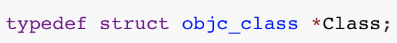

   * objc_class的定义

     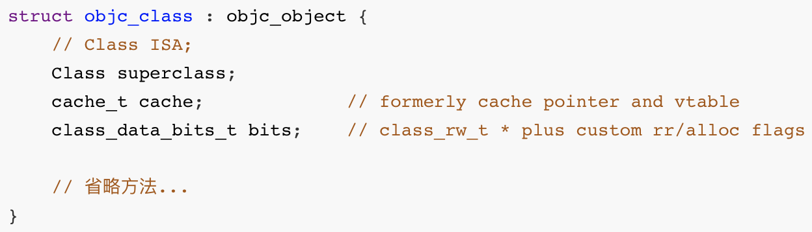

   * objc_object的定义

     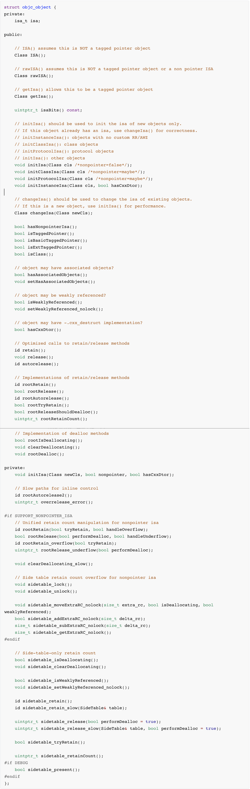

   * isa_t的定义

     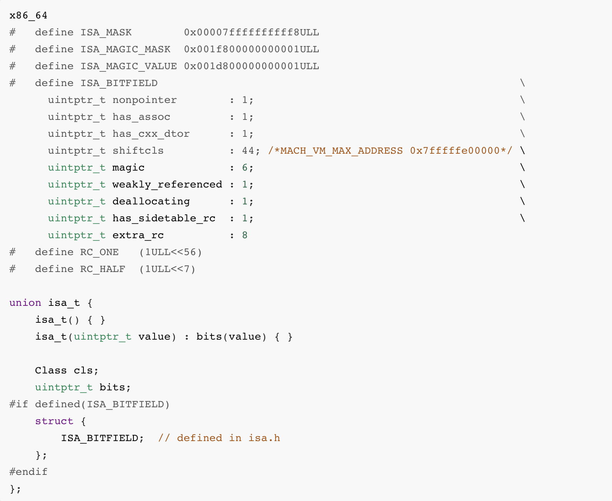

   * 类的结构

     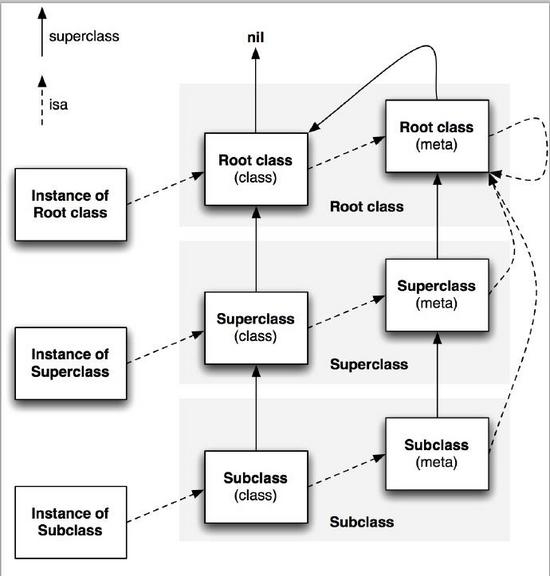

     `isa` 顾名思义 `is a` 表示对象所属的类。

     `isa` 指向他的类对象，从而可以找到对象上的方法。

     同一个类的不同对象，他们的 isa 指针是一样的
     
     

2. 一个OC对象如何进行内存布局

   - 所有父类的成员变量和自己的成员变量都会存放在该对象所对应的存储空间中.
   - 每一个对象内部都有一个isa指针,指向他的类对象,类对象中存放着本对象的

   1. 对象方法列表（对象能够接收的消息列表，保存在它所对应的类对象中）
   2. 成员变量的列表,
   3. 属性列表,

   它内部也有一个isa指针指向元对象(meta class),元对象内部存放的是类方法列表,类对象内部还有一个superclass的指针,指向他的父类对象。

   每个 Objective-C 对象都有相同的结构，如下图所示：

   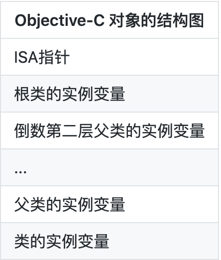

- 根对象就是NSObject，它的superclass指针指向nil

- 类对象既然称为对象，那它也是一个实例。类对象中也有一个isa指针指向它的元类(meta class)，即类对象是元类的实例。元类内部存放的是类方法列表，根元类的isa指针指向自己，superclass指针指向NSObject类

  

3. 关联对象的存储形式

   关联对象存储在散列表AssociationsHashMap中，它是一个单例对象，保存了所有分类对象的关联对象散列表，key有分类对象内存地址的hash值；对象AssociationsHashMap中的ObjectAssociationMap保存具体分类对象所有的关联对象，key为关联对象的关联字符串，ObjcAssociation是对关联对象的封装。

   * 内存布局

     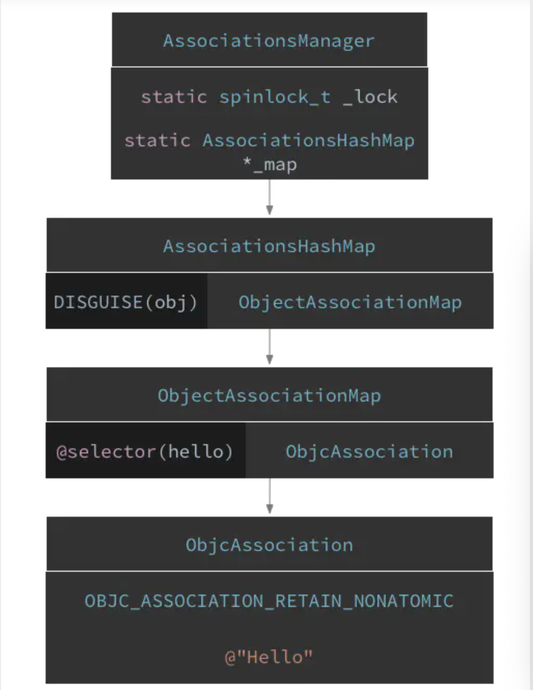

   * 获取关联对象

     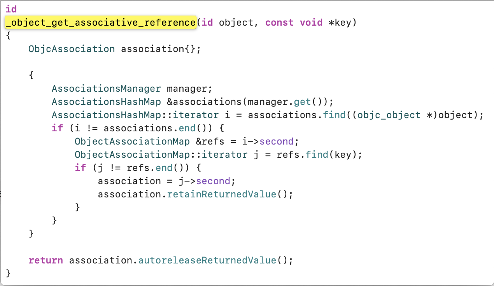

   

   * 移除所有关联对象

     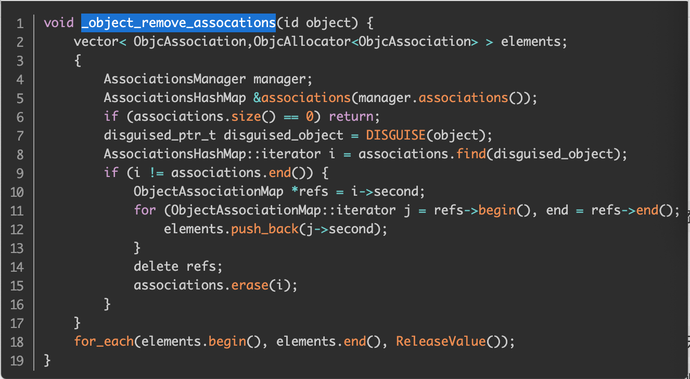

4. category的底层实现

   * 分类在_read_images函数中被注册到一个全局的hash表中

     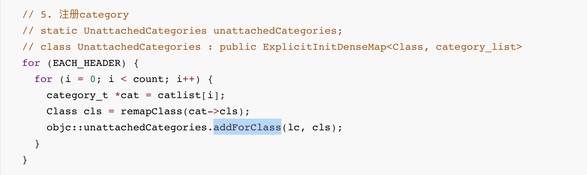

   * _read_images函数在运行时调用map_images时被间接调用

   * 保存分类信息的全局静态hash表是unattachedCategories

     ```c++
     class UnattachedCategories : public ExplicitInitDenseMap<Class, category_list>
     {
     public:
         void addForClass(locstamped_category_t lc, Class cls)
         {
             runtimeLock.assertLocked();
     
             if (slowpath(PrintConnecting)) {
                 _objc_inform("CLASS: found category %c%s(%s)",
                              cls->isMetaClass() ? '+' : '-',
                              cls->nameForLogging(), lc.cat->name);
             }
           // result -> std::pair<iterator, bool>
           // result.first -> iterator
           // iterator -> DenseMapIterator<Class, category_list, DenseMapValueInfo<category_list>, DenseMapInfo<Class>, detail::DenseMapPair<Class, category_list>>;
           // result.first->second -> category_list
             auto result = get().try_emplace(cls, lc);
             if (!result.second) {
                 result.first->second.append(lc);
             }
         }
       ...
     }
     ```

   * unattachedCategories通过成员方法addForClass注册分类

   * addForClass接收两个参数，一个参数是与分类关联的类，另一个是locstamped_category_t

     ```c++
     struct locstamped_category_t {
         category_t *cat;
         struct header_info *hi;
     };
     ```

   通过以上操作，类与分类就被关联在hash表unattachedCategories中了，通过类就能够在hash表unattachedCategories中找到其所有的分类

   ​	

   * unattachedCategories保存的是存根类的分类信息，存根类即还不知道其元类的类

   * 当存根类的元类被确定后，会调用methodizeClass函数，将分类中定义的对象方法、类方法、属性、协议信息合并到类信息中（类对象、元类对象中）

   * 如果类不是存根类，则直接将分类中定义的对象方法、类方法、属性、协议信息合并到类信息中（类对象、元类对象中）

     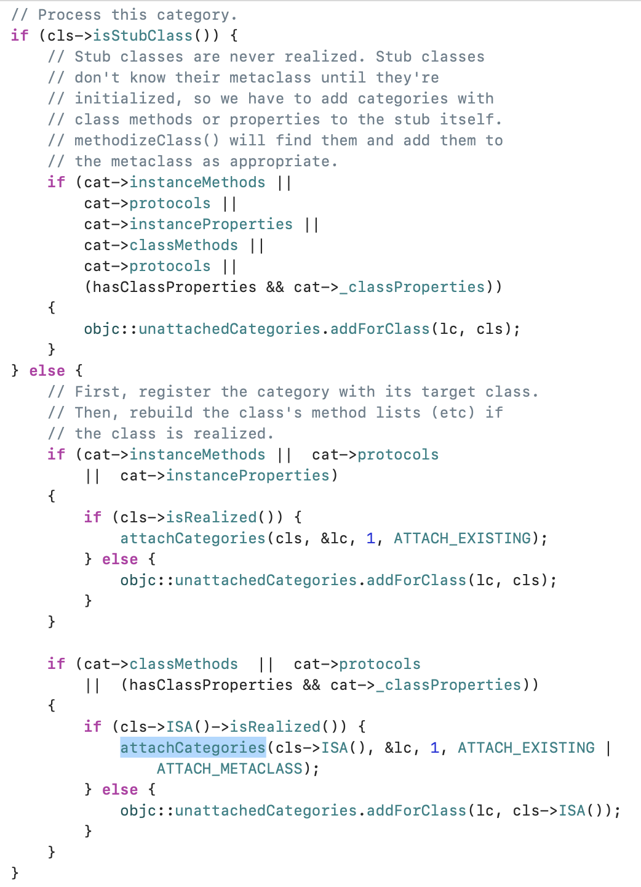

   * 合并分类中的信息到类信息中（类对象、元类对象中）通过函数attachCategories实现

     ```c++
     // Attach method lists and properties and protocols from categories to a class.
     // Assumes the categories in cats are all loaded and sorted by load order, 
     // oldest categories first.
     static void
     attachCategories(Class cls, const locstamped_category_t *cats_list, uint32_t cats_count,
                      int flags)
     {
         if (slowpath(PrintReplacedMethods)) {
             printReplacements(cls, cats_list, cats_count);
         }
         if (slowpath(PrintConnecting)) {
             _objc_inform("CLASS: attaching %d categories to%s class '%s'%s",
                          cats_count, (flags & ATTACH_EXISTING) ? " existing" : "",
                          cls->nameForLogging(), (flags & ATTACH_METACLASS) ? " (meta)" : "");
         }
     
         /*
          * Only a few classes have more than 64 categories during launch.
          * This uses a little stack, and avoids malloc.
          *
          * Categories must be added in the proper order, which is back
          * to front. To do that with the chunking, we iterate cats_list
          * from front to back, build up the local buffers backwards,
          * and call attachLists on the chunks. attachLists prepends the
          * lists, so the final result is in the expected order.
          */
         constexpr uint32_t ATTACH_BUFSIZ = 64;
         method_list_t   *mlists[ATTACH_BUFSIZ];
         property_list_t *proplists[ATTACH_BUFSIZ];
         protocol_list_t *protolists[ATTACH_BUFSIZ];
     
         uint32_t mcount = 0;
         uint32_t propcount = 0;
         uint32_t protocount = 0;
         bool fromBundle = NO;
         bool isMeta = (flags & ATTACH_METACLASS);
         auto rw = cls->data();
     
         for (uint32_t i = 0; i < cats_count; i++) {
             auto& entry = cats_list[i];
     
             method_list_t *mlist = entry.cat->methodsForMeta(isMeta);
             if (mlist) {
                 if (mcount == ATTACH_BUFSIZ) {
                     prepareMethodLists(cls, mlists, mcount, NO, fromBundle);
                     rw->methods.attachLists(mlists, mcount);
                     mcount = 0;
                 }
                 mlists[ATTACH_BUFSIZ - ++mcount] = mlist;
                 fromBundle |= entry.hi->isBundle();
             }
     
             property_list_t *proplist =
                 entry.cat->propertiesForMeta(isMeta, entry.hi);
             if (proplist) {
                 if (propcount == ATTACH_BUFSIZ) {
                     rw->properties.attachLists(proplists, propcount);
                     propcount = 0;
                 }
                 proplists[ATTACH_BUFSIZ - ++propcount] = proplist;
             }
     
             protocol_list_t *protolist = entry.cat->protocolsForMeta(isMeta);
             if (protolist) {
                 if (protocount == ATTACH_BUFSIZ) {
                     rw->protocols.attachLists(protolists, protocount);
                     protocount = 0;
                 }
                 protolists[ATTACH_BUFSIZ - ++protocount] = protolist;
             }
         }
     
         if (mcount > 0) {
             prepareMethodLists(cls, mlists + ATTACH_BUFSIZ - mcount, mcount, NO, fromBundle);
             rw->methods.attachLists(mlists + ATTACH_BUFSIZ - mcount, mcount);
             if (flags & ATTACH_EXISTING) flushCaches(cls);
         }
     
         rw->properties.attachLists(proplists + ATTACH_BUFSIZ - propcount, propcount);
     
         rw->protocols.attachLists(protolists + ATTACH_BUFSIZ - protocount, protocount);
     }
     ```

   通过分类信息合并：

   * 一个类所对应的分类下的对象方法，存放在该类的类对象的方法列表里面
   * 一个类所对应的分类下的类方法，会存放在该类的元类对象的方法列表里面
   * Category编译之后的底层结构是struct category_t，里面存储着分类的对象方法、类方法、属性、协议信息在程序运行的时候，runtime会将Category的数据，合并到类信息中（类对象、元类对象中）
   * Class Extension在编译的时候，它的数据就已经包含在类信息中
   * Category是在运行时，才会将数据合并到类信息中

   

5. 增加实例变量的方法

   * 编译后得到的类中

     不能向编译后得到的类中增加实例变量

     因为编译后的类已经注册在 runtime 中，类结构体中的 objc_ivar_list 实例变量的链表 和 instance_size 实例变量的内存大小已经确定，同时runtime 会调用 class_setIvarLayout 或 class_setWeakIvarLayout 来处理 strong weak 引用。所以不能向存在的类中添加实例变量

   * 运行时创建的类中

     能向运行时创建的类中添加实例变量

     运行时创建的类是可以添加实例变量，调用 class_addIvar 函数。但是得在调用 objc_allocateClassPair 之后，objc_registerClassPair 之前

     

6. weak的底层实现

   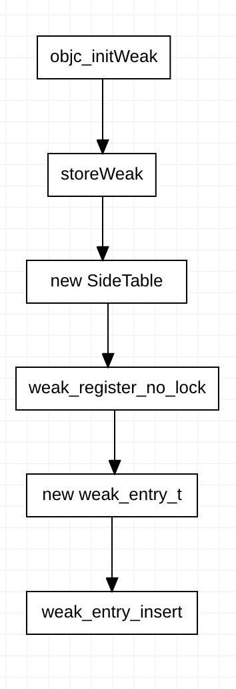

   * 不持有对象，对对象弱引用

     * OC对象及其所有弱引用对象的关联保存在SideTable表中的weak_table中

       ```c++
       struct SideTable {
           spinlock_t slock;
           RefcountMap refcnts; // 引用计数表
           weak_table_t weak_table; // weak表
       
           SideTable() {
               memset(&weak_table, 0, sizeof(weak_table));
           }
       
           ~SideTable() {
               _objc_fatal("Do not delete SideTable.");
           }
       
           void lock() { slock.lock(); }
           void unlock() { slock.unlock(); }
           void forceReset() { slock.forceReset(); }
       
           // Address-ordered lock discipline for a pair of side tables.
       
           template<HaveOld, HaveNew>
           static void lockTwo(SideTable *lock1, SideTable *lock2);
           template<HaveOld, HaveNew>
           static void unlockTwo(SideTable *lock1, SideTable *lock2);
       };
       
       struct weak_table_t {
           weak_entry_t *weak_entries;
           size_t    num_entries;
           uintptr_t mask;
           uintptr_t max_hash_displacement;
       };
       
       /// Adds an (object, weak pointer) pair to the weak table.
       id weak_register_no_lock(weak_table_t *weak_table, id referent, 
                                id *referrer, bool crashIfDeallocating);
       
       /// Removes an (object, weak pointer) pair from the weak table.
       void weak_unregister_no_lock(weak_table_t *weak_table, id referent, id *referrer);
       
       /// Called on object destruction. Sets all remaining weak pointers to nil.
       void weak_clear_no_lock(weak_table_t *weak_table, id referent);
       ```

       

     * 通过OC对象的地址可以获取该对象对应的SideTable表

       ```c++
       // 在storeWeak函数中完成
       SideTable *newTable = &SideTables()[newObj];
       ```

     * SideTables()返回SideTablesMap，它是一个全局的hash表，以对象的内存地址作为key，获取对应的SideTable

       ```
       使用hash表来管理对象的引用计数表及weak表是出于以下考虑:
       1. 内存中的对象个数是巨大的，如果用一个SideTable来管理，会导致频繁的内存分配及回收，hash冲突的概率会提高，导致对象插入及查找操作的效率下降，多线程环境下，对表频繁的加锁和解锁会极大的影响性能
       2. SideTablesMap是一个全局hash表，当通过对象的内存地址的操作来进行hash计算后，内存中的对象会比较均匀的分布到SideTablesMap中的各个hash表中
       3. SideTable结构中，有一个自旋锁，当通过对象的内存地址获取到相应的SideTable实例后，在对SideTable实例进行实际数据操作前会进行加锁，操作完毕后解锁；由于不需要对全局的hash表加解锁，保证了效率；仅仅对对象所在的SideTable实例加解锁，保证了数据的安全读写，这里用到了分离锁策略
       ```

     * 将对象的内存地址及weak变量保存在weak_entry_t中

       ```c
       struct weak_entry_t {
           DisguisedPtr<objc_object> referent;
           union {
               struct {
                   weak_referrer_t *referrers;
                   uintptr_t        out_of_line_ness : 2;
                   uintptr_t        num_refs : PTR_MINUS_2;
                   uintptr_t        mask;
                   uintptr_t        max_hash_displacement;
               };
               struct {
                   // out_of_line_ness field is low bits of inline_referrers[1]
                   weak_referrer_t  inline_referrers[WEAK_INLINE_COUNT];
               };
           };
       
           weak_entry_t(objc_object *newReferent, objc_object **newReferrer)
               : referent(newReferent)
           {
               inline_referrers[0] = newReferrer;
               for (int i = 1; i < WEAK_INLINE_COUNT; i++) {
                   inline_referrers[i] = nil;
               }
           }
       };
       ```

     * 通过OC对象的地址获取该对象在weak表中的weak_entry_t

       ```c
       // 在weak_register_no_lock函数中完成
       weak_entry_t *entry;
           if ((entry = weak_entry_for_referent(weak_table, referent))) {
               append_referrer(entry, referrer);
           } 
           else {
               weak_entry_t new_entry(referent, referrer);
               weak_grow_maybe(weak_table);
               weak_entry_insert(weak_table, &new_entry);
           }
       ```

       

   * 当对象销毁时，与之相关的所以weak变量被置空

     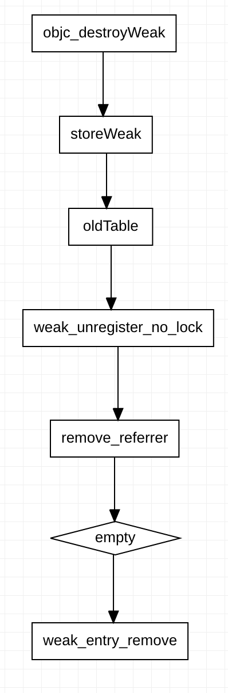

     * weak变量置空

       ```c
       void
       weak_unregister_no_lock(weak_table_t *weak_table, id referent_id, id *referrer_id)
       // 1. 调用weak_entry_for_referent获取对应的entry
       // 2. 调用remove_referrer(entry, referrer) 将weak变量置空
       ```

       

     * 置空OC对象关联的所有weak变量

       ```c
       // 将所有相关的weak变量置空
       void 
       weak_clear_no_lock(weak_table_t *weak_table, id referent_id) 
       // 调用weak_entry_for_referent查询referent_id对应的entry
       // 循环将entry中referrers的各元素置空
       ```

   

7. dealloc的底层实现

   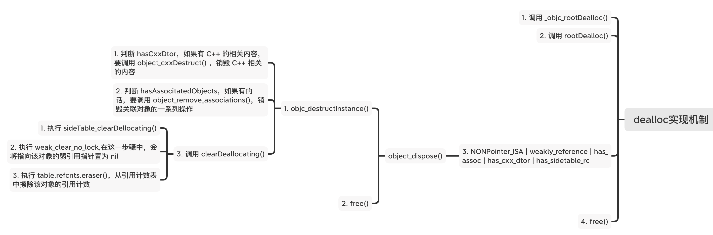

   

8. autoreleasepool的底层实现

   所有加入到自动释放池中的对象，都被保存在**AutoreleasePoolPage**中，它是一个由**AutoreleasePoolPage**组成的双向链表结构

   * AutoreleasePoolPage数据结构

     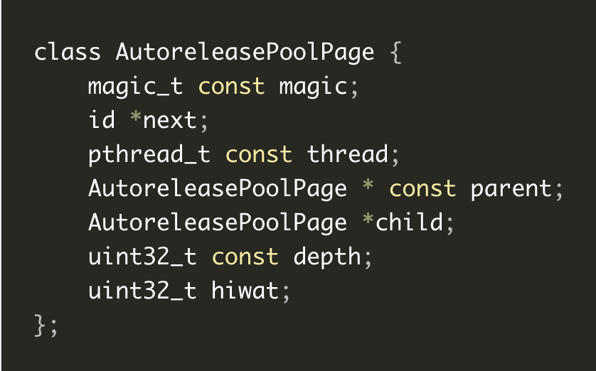

   * 自动释放池内存布局

     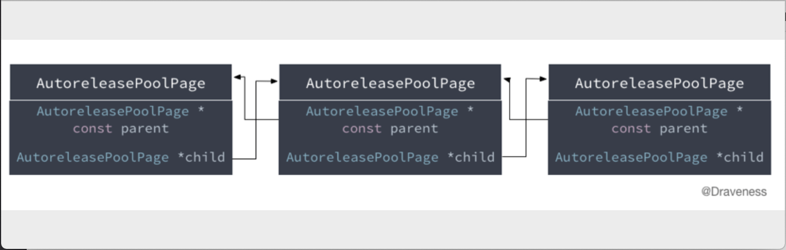

   * AutoreleasePoolPage内存布局

     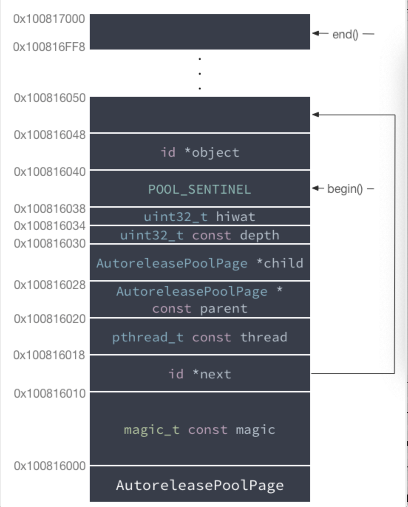

   * next指针

     ```
     指向AutoreleasePoolPage对象中，下一个添加到自动释放池对象所要存放的地址。类似于栈顶指针
     ```

   * objc_autoreleasePoolPush 方法

     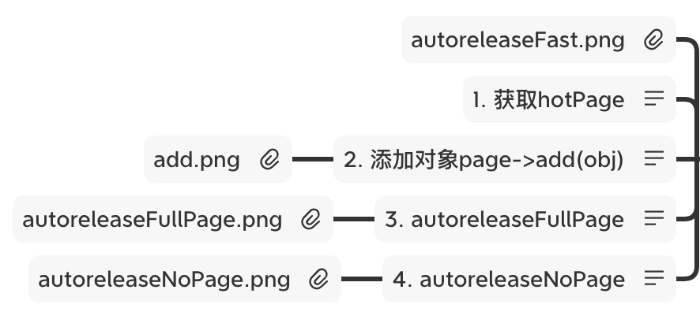

   * objc_autoreleasePoolPop 方法

     ```
     1. 使用 pageForPointer 获取当前 token 所在的 AutoreleasePoolPage
     2. 调用 releaseUntil 方法释放栈中的对象，直到 stop
     3. 调用 child 的 kill 方法
     ```

     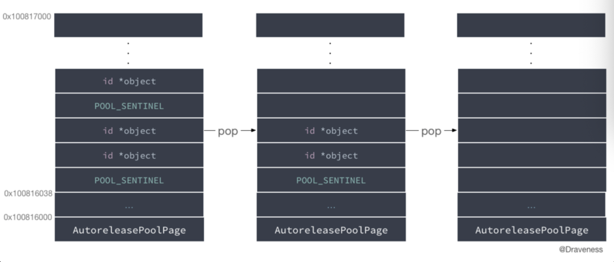

9. 如何检测内存泄漏

   * MLeaksFinder
   * Instruments中的Leak动态分析

   

10. 如何调试BAD_ACCESS错误

    * 通过 Zombie

      ```
      原理
      1. 开启Zombie Objects后，dealloc将会被hook，被hook后执行dealloc，内存并不会真正释放，系统会修改对象的isa指针，指向_NSZombie_前缀名称的僵尸类，将该对象变为僵尸对象
      2. 僵尸类做的事情比较单一，就是响应所有的方法：抛出异常，打印一条包含消息内容及其接收者的消息，然后终止程序
      3. Zombie Objects是无法检测内存越界的
      ```

    * 设置全局断点快速定位问题代码所在行

    * Address Sanitizer

      ```
      作用
      1. 内存释放后又被使用
      2. 内存重复释放
      3. 释放未申请的内存
      4. 使用栈内存作为函数返回值
      5. 使用了超出作用域的栈内存
      6. 内存越界访问
      
      原理
      1. 启用Address Sanitizer后，会在APP中增加libclang_rt.asan_ios_dynamic.dylib，它将在运行时加载
      2. Address Sanitizer替换了malloc和free的实现。当调用malloc函数时，它将分配指定大小的内存A，并将内存A周围的区域标记为”off-limits“
      3. 当free方法被调用时，内存A也被标记为”off-limits“，同时内存A被添加到隔离队列，这个操作将导致内存A无法再被重新malloc使用
      4. 当访问到被标记为”off-limits“的内存时，Address Sanitizer就会报告异常
      ```
    
    
    
11. 消息机制

    * 消息发送机制

      1. 查找当前类中的缓存，使用 `cache_getImp` 汇编程序入口。如果命中缓存获取到了 IMP，则直接跳到第 6 步；否则执行下一步。

         ```c++
         // IMP lookUpImpOrForward(id inst, SEL sel, Class cls, int behavior)
         if (fastpath(behavior & LOOKUP_CACHE)) {
             imp = cache_getImp(cls, sel);
             // 命中缓存
             if (imp) goto done_nolock;
           }
         ```

         

      2. 在当前类中的方法列表（method list）中进行查找，也就是根据 selector 查找到 Method 后，获取 Method 中的 IMP（也就是 `method_imp` 属性），并填充到缓存中。查找过程比较复杂，会针对已经排序的列表使用二分法查找，未排序的列表则是线性遍历。如果成功查找到 Method 对象，就直接跳到第 6 步；否则执行下一步。

         ```c++
         // 在类的方法列表中找, 找到后保存在缓存中
             Method meth = getMethodNoSuper_nolock(curClass, sel);
             if (meth) {
               imp = meth->imp;
               goto done;
             }
         ```

         

      3. 在继承层级中递归向父类中查找，情况跟上一步类似，也是先查找缓存，缓存没中就查找方法列表。这里跟上一步不同的地方在于缓存策略，有个 `_objc_msgForward_impcache` 汇编程序入口作为缓存中消息转发的标记。也就是说如果在缓存中找到了 IMP，但如果发现其内容是 `_objc_msgForward_impcache`，那就终止在类的继承层级中递归查找，进入下一步；否则跳到第 6 步。

         ```c++
         // 在类及其父类的方法列表中都找不到, 方法解析也未能找到其另外的实现，则开始消息转发逻辑
             if (slowpath((curClass = curClass->superclass) == nil)) {
               // No implementation found, and method resolver didn't help.
               // Use forwarding.
               imp = forward_imp;
               break;
             }
             
             // Superclass cache.
             imp = cache_getImp(curClass, sel);
             if (fastpath(imp)) {
               // Found the method in a superclass. Cache it in this class.
               goto done;
             }
         ```

         

      4. 当传入 `lookUpImpOrForward` 的参数 `resolver` 为 `YES` 并且是第一次进入第 4步时，时进入动态方法解析；否则进入下一步。这步消息转发前的最后一次机会。

         ```c++
         // 进行方法解析
           if (slowpath(behavior & LOOKUP_RESOLVER)) {
             behavior ^= LOOKUP_RESOLVER;
             return resolveMethod_locked(inst, sel, cls, behavior);
           }
         ```

         

      5. 此时不仅没查找到 IMP，动态方法解析也不奏效，只能将 `_objc_msgForward_impcache` 当做 IMP 并写入缓存。这也就是之前第 3 步中为何查找到 `_objc_msgForward_impcache` 就表明了要进入消息转发了。

         ```c++
         const IMP forward_imp = (IMP)_objc_msgForward_impcache;
         ```

         

      6. 读操作解锁，并将之前找到的 IMP 返回。

         ```c++
          done_nolock:
             if (slowpath((behavior & LOOKUP_NIL) && imp == forward_imp)) {
                 return nil;
             }
             return imp;
         ```

         

    * 消息转发机制

      

      * 动态方法解析

        *在该阶段中，我们可以动态的为类添加一个方法，从而让动态添加的方法来处理之前未能处理的消息，具体是在下面的方法中动态添加方法同时返回 YES，那么系统就会重给对象发送刚才的消息来执行*

        ```objective-c
        #import <Foundation/Foundation.h>
        #import <objc/runtime.h>
        
        void test1test1(id self, SEL _cmd) {
            NSLog(@"test1test1 %@ %@", NSStringFromSelector(_cmd) ,self);
        }
        
        @interface BMPerson : NSObject
        - (void)test1;
        @end
        @implementation BMPerson
        + (BOOL)resolveInstanceMethod:(SEL)sel {
            NSLog(@"%@", NSStringFromSelector(sel));
            class_addMethod(BMPerson.class, NSSelectorFromString(@"test1"), (IMP) test1test1, NULL);
            return YES;
        }
        @end
        
        int main(int argc, const char * argv[]) {
            BMPerson *peron = BMPerson.new;
            [peron test1];
            return 0;
        }
        ```

        

      * 转发

        *这个阶段系统是要求我们给他返回一个可以正常响应此消息的对象，系统就会把刚才的消息转发给开发者返回的对象，让新的对象去响应此消息*

        ```objective-c
        #import <Foundation/Foundation.h>
        
        @interface BMGood : NSObject
        @end
        @implementation BMGood
        - (void)test1 {
            NSLog(@"BMGood test1");
        }
        @end
        
        
        @interface BMPerson : NSObject
        - (void)test1;
        @end
        @implementation BMPerson
        - (id)forwardingTargetForSelector:(SEL)aSelector {
            return BMGood.new;
        }
        
        @end
        
        int main(int argc, const char * argv[]) {
            BMPerson *peron = BMPerson.new;
            [peron test1];
            return 0;
        }
        ```

        

      * 自由派发

        *这个阶段是最后一次机会，也是最强大的一步，因为在这里我们可以任意的转发给其他对象，而且可以转发给多个其他对象*

        ```objective-c
        #import <Foundation/Foundation.h>
        
        @interface BMGood : NSObject
        @end
        @implementation BMGood
        - (void)test1BMGood {
            NSLog(@"BMGood test1BMGood");
        }
        @end
        
        @interface BMPerson : NSObject
        - (void)test1;
        @end
        @implementation BMPerson
        - (NSMethodSignature *)methodSignatureForSelector:(SEL)aSelector {
            NSLog(@"%@", NSStringFromSelector(aSelector));
            SEL selector = @selector(test1BMGood);
            // 创建NSMethodSignature
            BMGood *target =  BMGood.new;
            NSMethodSignature *signature = [target methodSignatureForSelector:selector];
            // 创建NSInvocation
            NSInvocation *invocation = [NSInvocation invocationWithMethodSignature:signature];
            // 设置target
            invocation.target = target;
            // 设置SEL
            invocation.selector = selector;
            // 开始调用
            [invocation invoke];
            return signature;
        }
        - (void)forwardInvocation:(NSInvocation *)anInvocation {
            NSLog(@"%@", anInvocation);
        }
        @end
        
        int main(int argc, const char * argv[]) {
            BMPerson *peron = BMPerson.new;
            [peron test1];
            return 0;
        }
        ```

      * 崩溃阶段

        *如果在上面的 3 步都没挽救，那么系统会调用 `doesNotRecognizeSelector` 方法来输出崩溃的日志信息*

12. 在block外定义weakSelf引用self，在block内定义strongSelf引用weakSelf原因

    * 在block外定义weakSelf引用self

      *block会强引用被捕获的对象，为了避免循环引用，所以用weakSelf引用self*

    * 在block内定义strongSelf引用weakSelf

      *block被异步执行时，self可能已经被释放掉，weakSelf则被置空，为了避免block执行时因self被释放导致block执行逻辑异常，所以用strongSelf引用weakSelf*


13. block的底层实现

    * 截获自动变量值

       *Block语法表达式中使用的自动变量被作为成员变量追加到了__main_block_impl_0结构中*

       * block的数据结构

         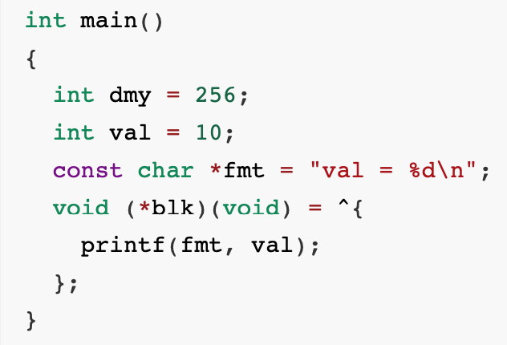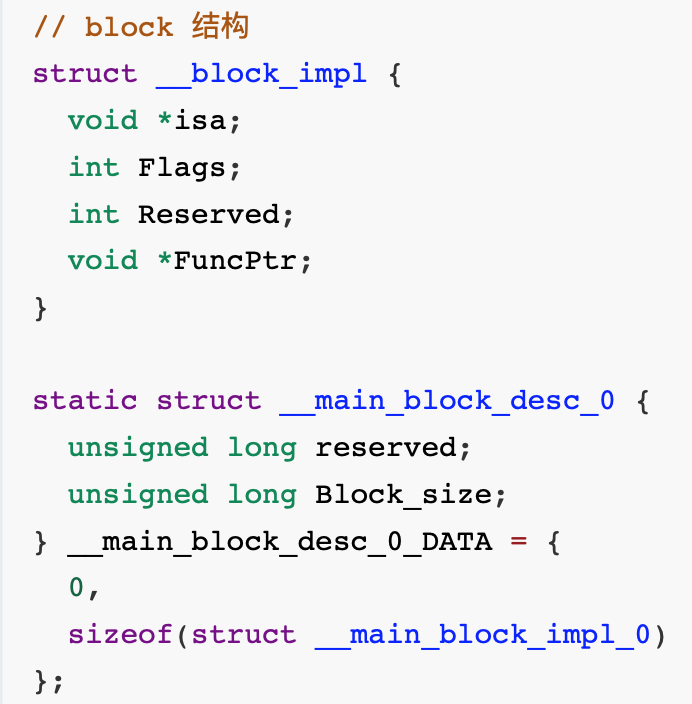

    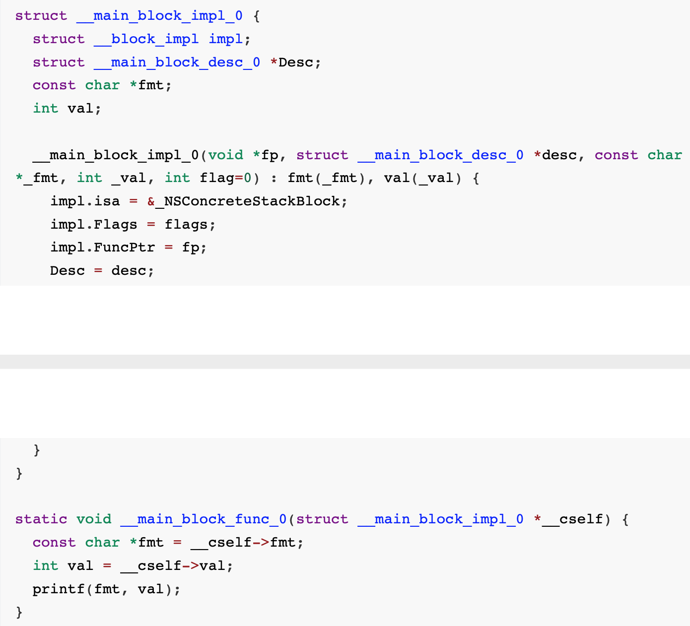

    

    * __block说明符

        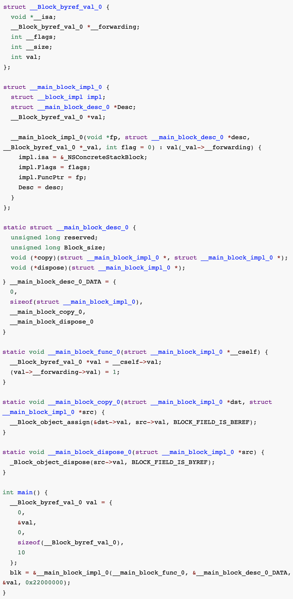

    * 存储域

       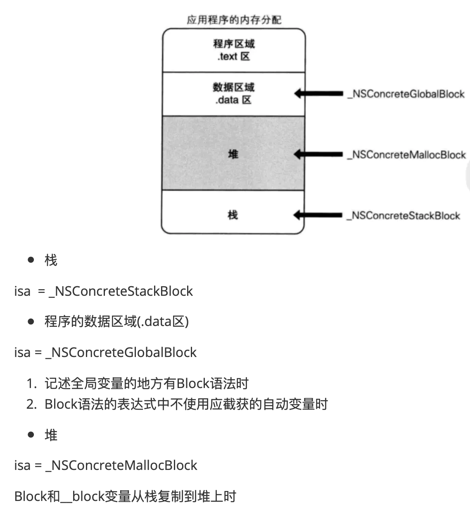

    * Block超出变量作用域可存在的原因

       ```
       1. 大多数情况下，编译器会自动的生成复制Block到堆上的代码，如Block作为函数的返回值 
       2. 向方法或函数的参数中传递Block 
       
       上的Block复制到堆上的时机 
       调用Block的copy方法
       Block作为函数返回值时 
       将Block赋值给附有__strong修饰符id类型的类或Block类型成员变量时 
       在方法中含有usingBlock的cocoa框架方法或GCD的API中传递Block时 
       ```

       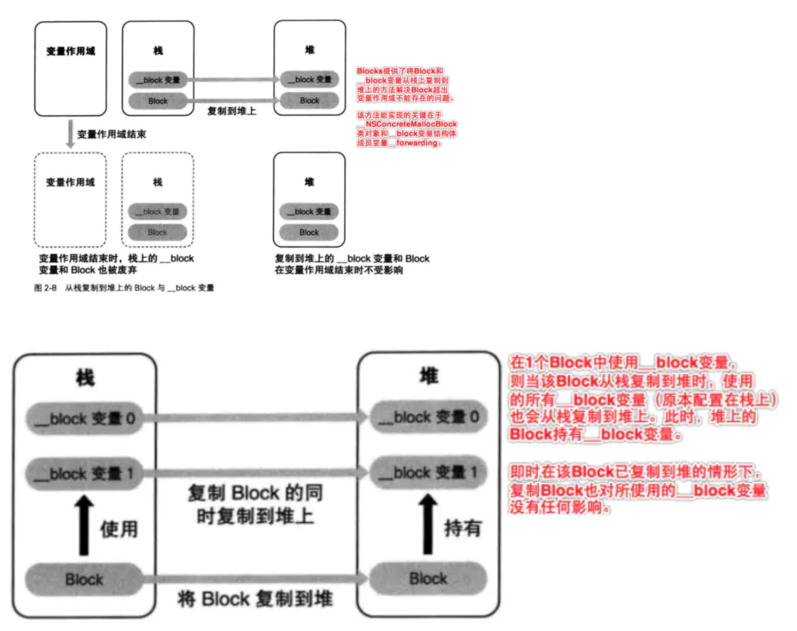

    

    * __block变量结构体成员变量__forwarding存在的原因

       *forwarding可以实现，无论是在Block语法中，Block语法外使用 block变量，还是**_**_block变量配置在栈 上或堆上，都可以顺利访问同一个__block变量*

       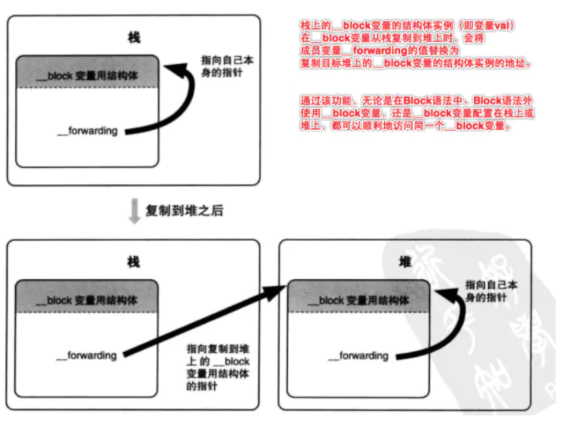

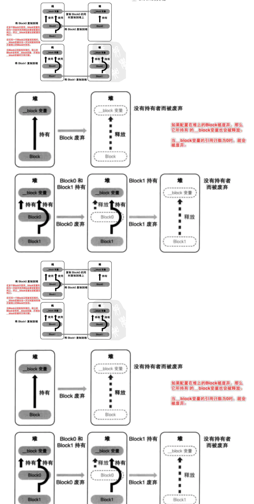


14. KVO底层实现

    *当观察一个对象时，一个新的类会动态被创建。这个类继承自该对象的原本的类，并重写了被观察属性的 `setter` 方法。重写的 `setter` 方法会负责在调用原 `setter` 方法之前和之后，通知所有观察对象值的更改。最后把这个对象的 `isa` 指针 ( `isa` 指针告诉 Runtime 系统这个对象的类是什么 ) 指向这个新创建的子类，对象就神奇的变成了新创建的子类的实例*

    *  检查对象的类有没有相应的 setter 方法，如果没有抛出异常

      ```
      通过 setterForGetter() 方法获得相应的 setter 的名字（SEL）。也就是把 key 的首字母大写，然后前面加上 set 后面加上 :，这样 key 就变成了 setKey:。然后再用 class_getInstanceMethod 去获得 setKey: 的实现（Method）。如果没有，自然要抛出异常
      ```

      

    * 检查对象 isa 指向的类是不是一个 KVO 类，如果不是，新建一个继承原来类的子类，并把 isa 指向这个新建的子类

      ```
      看类名有没有我们定义的前缀。如果没有，我们就去创建新的子类，并通过 object_setClass() 修改 isa 指针。动态创建新的类需要用 objc/runtime.h 中定义的 objc_allocateClassPair() 函数。传一个父类，类名，然后额外的空间（通常为 0），它返回给你一个类。然后就给这个类添加方法，也可以添加变量。这里，我们只重写了 class 方法。最后 objc_registerClassPair() 告诉 Runtime 这个类的存在
      ```

      

    * 检查对象的 KVO 类重写过没有这个 setter 方法，如果没有，添加重写的 setter 方法

      ```
      重写 setter 方法。新的 setter 在调用原 setter 方法后，通知每个观察者
      ```

    * 添加这个观察者

      ```
      把这个观察的相关信息存在 associatedObject 里
      ```

15. KVC底层实现

    *在`KVC`的实现中，依赖`setter`和`getter`的方法实现，所以方法命名应该符合苹果要求的规范，否则会导致`KVC`失败*

    * 基础Getter搜索模式

      *这是`valueForKey:`的默认实现，给定一个`key`当做输入参数*

    * 基础Setter搜索模式

      *这是`setValue:forKey:`的默认实现，给定输入参数`value`和`key`*


16. runloop原理

    [runloop](https://blog.ibireme.com/2015/05/18/runloop/)

    * runloop对象

      * NSRunLoop （提供了纯 C 函数的 API，所有这些 API 都是线程安全的）
      * CFRunLoopRef （提供了面向对象的 API，但是这些 API 不是线程安全的）

    * 与线程的关系

      *苹果不允许直接创建 RunLoop，它只提供了两个自动获取的函数：CFRunLoopGetMain() 和 CFRunLoopGetCurrent(), 线程和 RunLoop 之间是一一对应的，其关系是保存在一个全局的 Dictionary 里。线程刚创建时并没有 RunLoop，如果你不主动获取，那它一直都不会有。RunLoop 的创建是发生在第一次获取时，RunLoop 的销毁是发生在线程结束时*

      ```c
      /// 全局的Dictionary，key 是 pthread_t， value 是 CFRunLoopRef
      static CFMutableDictionaryRef loopsDic;
      /// 访问 loopsDic 时的锁
      static CFSpinLock_t loopsLock;
       
      /// 获取一个 pthread 对应的 RunLoop。
      CFRunLoopRef _CFRunLoopGet(pthread_t thread) {
          OSSpinLockLock(&loopsLock);
          
          if (!loopsDic) {
              // 第一次进入时，初始化全局Dic，并先为主线程创建一个 RunLoop。
              loopsDic = CFDictionaryCreateMutable();
              CFRunLoopRef mainLoop = _CFRunLoopCreate();
              CFDictionarySetValue(loopsDic, pthread_main_thread_np(), mainLoop);
          }
          
          /// 直接从 Dictionary 里获取。
          CFRunLoopRef loop = CFDictionaryGetValue(loopsDic, thread));
          
          if (!loop) {
              /// 取不到时，创建一个
              loop = _CFRunLoopCreate();
              CFDictionarySetValue(loopsDic, thread, loop);
              /// 注册一个回调，当线程销毁时，顺便也销毁其对应的 RunLoop。
              _CFSetTSD(..., thread, loop, __CFFinalizeRunLoop);
          }
          
          OSSpinLockUnLock(&loopsLock);
          return loop;
      }
       
      CFRunLoopRef CFRunLoopGetMain() {
          return _CFRunLoopGet(pthread_main_thread_np());
      }
       
      CFRunLoopRef CFRunLoopGetCurrent() {
          return _CFRunLoopGet(pthread_self());
      ```

    * 对外接口

      * CFRunLoopSourceRef

        * Source0 

          只包含了一个回调（函数指针），它并不能主动触发事件。使用时，你需要先调用 CFRunLoopSourceSignal(source)，将这个 Source 标记为待处理，然后手动调用 CFRunLoopWakeUp(runloop) 来唤醒 RunLoop，让其处理这个事件。

        * Source1

          包含了一个 mach_port 和一个回调（函数指针），被用于通过内核和其他线程相互发送消息。这种 Source 能主动唤醒 RunLoop 的线程

      * CFRunLoopTimerRef

        是基于时间的触发器

      * CFRunLoopObserverRef

        是观察者，每个 Observer 都包含了一个回调（函数指针），当 RunLoop 的状态发生变化时，观察者就能通过回调接受到这个变化

    * Mode

      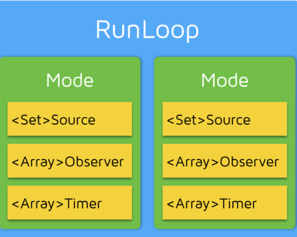

      *一个 RunLoop 包含若干个 Mode，每个 Mode 又包含若干个 Source/Timer/Observer。每次调用 RunLoop 的主函数时，只能指定其中一个 Mode，这个Mode被称作 CurrentMode。如果需要切换 Mode，只能退出 Loop，再重新指定一个 Mode 进入*

      ```c
      // CFRunLoopMode 和 CFRunLoop 的结构大致如下：
      struct __CFRunLoopMode {
          CFStringRef _name;            // Mode Name, 例如 @"kCFRunLoopDefaultMode"
          CFMutableSetRef _sources0;    // Set
          CFMutableSetRef _sources1;    // Set
          CFMutableArrayRef _observers; // Array
          CFMutableArrayRef _timers;    // Array
          ...
      };
       
      struct __CFRunLoop {
          CFMutableSetRef _commonModes;     // Set
          CFMutableSetRef _commonModeItems; // Set<Source/Observer/Timer>
          CFRunLoopModeRef _currentMode;    // Current Runloop Mode
          CFMutableSetRef _modes;           // Set
          ...
      };
      ```

      *CommonModes: 一个 Mode 可以将自己标记为”Common”属性, 当 RunLoop 的内容发生变化时，RunLoop 都会自动将 _commonModeItems 里的 Source/Observer/Timer 同步到具有 “Common” 标记的所有Mode里*

    * 内部逻辑

      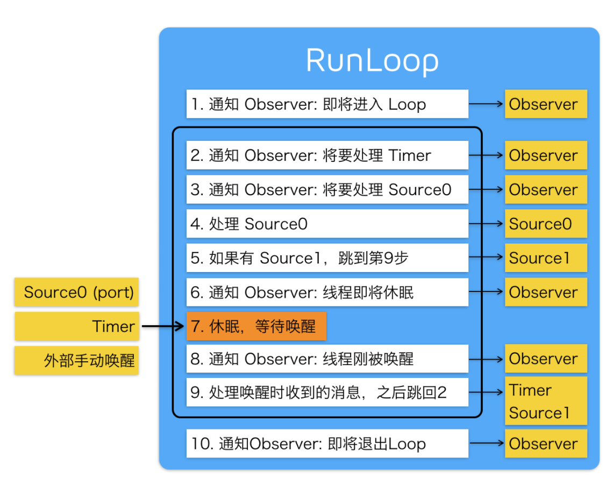

    * 应用

      * AutoreleasePool

        *App启动后，苹果在主线程 RunLoop 里注册了两个 Observer，其回调都是 _wrapRunLoopWithAutoreleasePoolHandler()。第一个 Observer 监视的事件是 Entry(即将进入Loop)，其回调内会调用 _objc_autoreleasePoolPush() 创建自动释放池；第二个 Observer 监视了两个事件： BeforeWaiting(准备进入休眠) 时调用_objc_autoreleasePoolPop() 和 _objc_autoreleasePoolPush() 释放旧的池并创建新池；Exit(即将退出Loop) 时调用 _objc_autoreleasePoolPop() 来释放自动释放池。*

      * 事件响应

        *苹果注册了一个 Source1 (基于 mach port 的) 用来接收系统事件，其回调函数为 __IOHIDEventSystemClientQueueCallback()。当一个硬件事件(触摸/锁屏/摇晃等)发生后，首先由 IOKit.framework 生成一个 IOHIDEvent 事件并由 SpringBoard 接收，随后用 mach port 转发给需要的App进程，随后苹果注册的那个 Source1 就会触发回调，并调用 _UIApplicationHandleEventQueue() 进行应用内部的分发，_UIApplicationHandleEventQueue() 会把 IOHIDEvent 处理并包装成 UIEvent 进行处理或分发，其中包括识别 UIGesture/处理屏幕旋转/发送给 UIWindow 等*

      * 手势识别

        *_UIApplicationHandleEventQueue() 识别了一个手势时，其首先会调用 Cancel 将当前的 touchesBegin/Move/End 系列回调打断。随后系统将对应的 UIGestureRecognizer 标记为待处理，苹果注册了一个 Observer 监测 BeforeWaiting (Loop即将进入休眠) 事件，这个Observer的回调函数是 _UIGestureRecognizerUpdateObserver()，其内部会获取所有刚被标记为待处理的 GestureRecognizer，并执行GestureRecognizer的回调*

      * GCD

        *当调用 dispatch_async(dispatch_get_main_queue(), block) 时，libDispatch 会向主线程的 RunLoop 发送消息，RunLoop会被唤醒，并从消息中取得这个 block，并在回调 __CFRUNLOOP_IS_SERVICING_THE_MAIN_DISPATCH_QUEUE__() 里执行这个 block。但这个逻辑仅限于 dispatch 到主线程*

        

17. 卡顿检测

    导致卡顿问题的几种原因：

    * 复杂 UI 、图文混排的绘制量过大；
    * 在主线程上做网络同步请求；
    * 在主线程做大量的 IO 操作；
    * 运算量过大，CPU 持续高占用；
    * 死锁和主子线程抢锁

    

    利用runloop检测卡顿：

    *如果 RunLoop 的线程，进入睡眠前方法的执行时间过长而导致无法进入睡眠，或者线程唤醒后接收消息时间过长而无法进入下一步的话，就可以认为是线程受阻了。如果这个线程是主线程的话，表现出来的就是出现了卡顿。利用 RunLoop 原理来监控卡顿，要关注这两个阶段，RunLoop 在进入睡眠之前和唤醒后的两个 loop 状态定义的值，分别是 kCFRunLoopBeforeSources 和 kCFRunLoopAfterWaiting ，也就是要触发 Source0 回调和接收 mach_port 消息两个状态；创建观察者 runLoopObserver 添加到主线程 RunLoop 的 **common** 模式下观察， 然后，创建一个持续的子线程专门用来监控主线程的 RunLoop 状态， 一旦发现进入睡眠前的 kCFRunLoopBeforeSources 状态，或者唤醒后的状态 kCFRunLoopAfterWaiting，在设置的时间阈值内一直没有变化，即可判定为卡顿*

    

18. feed流优化

    *文本宽高的计算、大量文本的绘制、大量图片的解码绘制以及AutoLayout带来的性能影响*

    * 调整视图结构

      ```
      通过identifier来确定cell的子视图，避免将所有子视图都放到cell中
      ```

    * 文本渲染

      ```
      常见的文本控件（UILabel、UITextView等）、其排版和绘制都是在主线程进行的，当文本数量很大时，CPU压力非常大。对此的解决方案是，自定义文本控件，用TextKit或者CoreText对文本异步绘制。可以参考YYTextKit。
      ```

    * 图像的绘制

      ```
      图像的绘制通常是指用那些以 CG 开头的方法把图像绘制到画布中，然后从画布创建图片并显示这样一个过程。这个最常见的地方就是 [UIView drawRect:] 里面了。由于 CoreGraphic 方法通常都是线程安全的，所以图像的绘制可以很容易的放到后台线程进行
      ```

    * 离屏渲染

      ```
      CALayer的 border、圆角、阴影、屏蔽，CASharpLayer的矢量图显示，通常会触发离屏渲染。而离屏渲染通常发生在GPU中。开启 CALayer.shouldRasterize属性会使视图渲染内容被缓存起来，下次绘制的时候可以直接显示缓存。而最彻底的解决办法是：把需要显示的图型在后台线程绘制为图片，避免使用圆角、阴影屏蔽等属性。
      ```

    * cell高度缓存

      ```
      FDTemplateLayoutCell缓存了Cell高度避免重复计算
      ```

    * 引入ASDisplayKit

      ```
      引入ASDisplayKit异步渲染框架，替换文本控件和图片控件。ASDisplayKit的核心思想是将所有能异步执行的操作如：文本和布局的计算、渲染、图片的解码、绘制等通通从主线程移到子线程。
      ```

19. 离屏渲染

*如果要在显示屏上显示内容，我们至少需要一块与屏幕像素数据量一样大的frame buffer，作为像素数据存储区域，而这也是GPU存储渲染结果的地方。如果有时因为面临一些限制，无法把渲染结果直接写入frame buffer，而是先暂存在另外的内存区域，之后再写入frame buffer，那么这个过程被称之为离屏渲染*

触发离屏渲染：

* 圆角

  ```
  1. 将一个layer的内容裁剪成圆角，可能不存在一次遍历就能完成的方法
  2. 容器的子layer因为父容器有圆角，那么也会需要被裁剪，而这时它们还在渲染队列中排队，尚未被组合到一块画布上，自然也无法统一裁剪
  
  此时我们就不得不开辟一块独立于frame buffer的空白内存，先把容器以及其所有子layer依次画好，然后把四个角“剪”成圆形，再把结果画到frame buffer中
  ```

* 设置mask

  ```
  mask是应用在layer和其所有子layer的组合之上的，而且可能带有透明度，那么其实和group opacity的原理类似，不得不在离屏渲染中完成
  ```

* 设置阴影

* opacity

  ```
  alpha并不是分别应用在每一层之上，而是只有到整个layer树画完之后，再统一加上alpha，最后和底下其他layer的像素进行组合。显然也无法通过一次遍历就得到最终结果
  ```


20. 事件处理

    * 事件传递

      ```
      触摸事件的传递是从父控件传递到子控件，即UIApplication->window->寻找处理事件最合适的view
      
      hitTest:withEvent:方法
      只要事件一传递给一个控件,这个控件就会调用他自己的hitTest:withEvent:方法, 寻找并返回最合适的view
      
      pointInside方法
      pointInside:withEvent:方法判断点在不在当前view上
      
      如何找到最合适的控件来处理事件？
      1. 首先判断主窗口（keyWindow）自己是否能接受触摸事件
      2. 判断触摸点是否在自己身上
      3. 子控件数组中从后往前遍历子控件，重复前面的两个步骤
      4. view，比如叫做fitView，那么会把这个事件交给这个fitView，再遍历这个fitView的子控件，直至没有更合适的view为止。
      如果没有符合条件的子控件，那么就认为自己最合适处理这个事件，也就是自己是最合适的view
      
      ```

    * 事件响应

      ```
      1. 如果当前view是控制器的view，那么控制器就是上一个响应者，事件就传递给控制器；如果当前view不是控制器的view，那么父视图就是当前view的上一个响应者，事件就传递给它的父视图
      2. 在视图层次结构的最顶级视图，如果也不能处理收到的事件或消息，则其将事件或消息传递给window对象进行处理
      3. 如果window对象也不处理，则其将事件或消息传递给UIApplication对象
      4. 如果UIApplication也不能处理该事件或消息，则将其丢弃
      ```

21. GCD

    * dispatch_set_target_queue

      变更生成的Dispatch queue的优先级

      ```objective-c
      dispatch_queue_t serialQueue = dispatch_queue_create("com.gcd.setTargetQueue.serialQueue", NULL);
      //获取优先级为后台优先级的全局队列
      dispatch_queue_t globalDefaultQueue = dispatch_get_global_queue(DISPATCH_QUEUE_PRIORITY_BACKGROUND, 0);
      //变更优先级
      dispatch_set_target_queue(serialQueue, globalDefaultQueue);
      ```

    * dispatch_barrier_async

      dispatch_barrier_async函数会等待追加到并行队列上的任务全部执行完后再将指定的任务追加到该并行队列中

      ```objective-c
      dispatch_queue_t queue = dispatch_get_global_queue(DISPATCH_QUEUE_PRIORITY_BACKGROUND, 0);
      
      dispatch_async(queue, blk0_for_reading)
      dispatch_async(queue, blk1_for_reading)
      dispatch_async(queue, blk2_for_reading)
      dispatch_barrier_async(queue, blk_for_writing);
      dispatch_async(queue, blk3_for_reading)
      dispatch_async(queue, blk4_for_reading)
      dispatch_async(queue, blk5_for_reading)
      ```

    * dispatch_suspend / dispatch_resume

    * Dispatch I/O 一次使用多个线程并行读取文件

    * Dispatch Source (通过内核函数获取时间, 不会受runloop轮询的影响, 时间更加准确)

      ```objective-c
      dispatch_source_t timer = dispatch_source_create(DISPATCH_SOURCE_TYPE_TIMER, 0, 0, queue);
          dispatch_source_set_timer(timer, DISPATCH_TIME_NOW, timeInterval * NSEC_PER_SEC, start * NSEC_PER_SEC);
      dispatch_source_set_event_handler(timer, ^{
              task();
              if (!repeat) {
                  [self cancelTask:timerKey];
              }
          });
          dispatch_resume(timer);
      ```

22. 锁

    * 自旋锁

      ```
      OSSpinLock 不再安全，主要原因发生在低优先级线程拿到锁时，高优先级线程进入忙等(busy-wait)状态，消耗大量 CPU 时间，从而导致低优先级线程拿不到 CPU 时间，也就无法完成任务并释放锁。这种问题被称为优先级反转。
      ```

    * 互斥锁

      * NSLock
      * pthread_mutex
      * @synchronized

    * 读写锁

      ```
      用于解决多线程对公共资源读写问题，读操作可并发重入，写操作是互斥的
      //加读锁
      pthread_rwlock_rdlock(&rwlock);
      //解锁
      pthread_rwlock_unlock(&rwlock);
      //加写锁
      pthread_rwlock_wrlock(&rwlock);
      //解锁
      pthread_rwlock_unlock(&rwlock);
      ```

    * 递归锁

      ```
      同一个线程可以加锁N次而不会引发死锁
      ```

    * 条件锁

    * 信号量

23. 手势识别过程

    ```
    手势识别操作是在常规视图响应链之外的. 首先 UIWindow 会将触碰事件发送到手势识别对象, 他们必须指明无法处理该事件, 之后该事件才会默认向前传到视图的响应链。
    
    事件发生的顺序：
    
    1. 窗口会将触碰事件发送到手势识别对象
    2. 手势识别对象将进入 UIGestureRecognizerStatePossible 状态
    3. 对于离散型手势, 手势识别对象会判断他是 UIGestureRecognizerStateRecognized 还是 UIGestureRecognizerStateFailed 类型
    	a. 如果是 UIGestureRecognizerStateRecognized, 手势识别接收触碰时间并调用指定的委托方法
    	b. 如果是 UIGestureRecognizerStateFailed, 手势识别对象将触碰事件返回到响应链
    4. 对于连续型手势, 手势识别对象会判断他是 UIGestureRecognizerStateBegan 还是UIGestureRecognizerStateFailed
    	a. 如果是 UIGestureRecognizerStateBegan, 手势识别对象会接收触控事件并调用指定的委托方法. 之后每当手势发生变化时就将状态更新为 UIGestureRecognizerStateChanged, 并始终调用委托方法, 直到最后的触碰事件结束, 此时状态为 UIGestureRecognizerStateEnded. 如果触碰模式不再和期望的手势相匹配, 可以将状态改为 UIGestureRecognizerStateCancelled
    	b. 如果是 UIGestureRecognizerStateFailed, 手势识别对象将触碰事件返回到响应链
    ```


24. App启动速度优化

    **App 的启动主要包括三个阶段：**

    1. main() 函数执行前

       * 加载可执行文件（App 的.o 文件的集合）
       * 加载动态链接库，进行 rebase 指针调整和 bind 符号绑定
       * Objc 运行时的初始处理，包括 Objc 相关类的注册、category 注册、selector 唯一性检查等
       * 初始化，包括了执行 +load() 方法、attribute((constructor)) 修饰的函数的调用、创建 C++ 静态全局变量

       ```
       优化：
       1. 减少动态库加载。每个库本身都有依赖关系，苹果公司建议使用更少的动态库，并且建议在使用动态库的数量较多时，尽量将多个动态库进行合并
       2. 减少加载启动后不会去使用的类或者方法
       3. +load() 方法里的内容可以放到首屏渲染完成后再执行，或使用 +initialize() 方法替换掉。因为，在一个 +load() 方法里，进行运行时方法替换操作会带来 4 毫秒的消耗
       4. 控制 C++ 全局变量的数量
       ```

       

    2. main() 函数执行后

       *main() 函数执行后的阶段，指的是从 main() 函数执行开始，到 appDelegate 的 didFinishLaunchingWithOptions 方法里首屏渲染相关方法执行完成*

       * 首屏初始化所需配置文件的读写操作
       * 首屏列表大数据的读取
       * 首屏渲染的大量计算等

       ```
       优化：
       从功能上梳理出哪些是首屏渲染必要的初始化功能，哪些是 App 启动必要的初始化功能，而哪些是只需要在对应功能开始使用时才需要初始化的。梳理完之后，将这些初始化功能分别放到合适的阶段进行
       ```

       

    3. 首屏渲染完成后

       *这个阶段就是从渲染完成时开始，到 didFinishLaunchingWithOptions 方法作用域结束时结束*

       

    **对 App 启动速度的监控**

    *对 objc_msgSend 方法进行 hook 来掌握所有方法的执行耗时*

    

25. App 包大小优化

    * 图片资源压缩

      *比较好的压缩方案是，将图片转成 WebP*

      ```
      1. WebP 压缩率高，而且肉眼看不出差异，同时支持有损和无损两种压缩模式。比如，将 Gif 图转为 Animated WebP ，有损压缩模式下可减少 64% 大小，无损压缩模式下可减少 19% 大小。
      2. WebP 支持 Alpha 透明和 24-bit 颜色数，不会像 PNG8 那样因为色彩不够而出现毛边。
      ```

    * 代码瘦身

      *App 的安装包主要是由资源和可执行文件组成，可执行文件就是 Mach-O 文件，其大小是由代码量决定的。通常情况下，对可执行文件进行瘦身，就是找到并删除无用代码的过程*

      * 首先，找出方法和类的全集

        ```
        我们可以通过分析 LinkMap 来获得所有的代码类和方法的信息。获取 LinkMap 可以通过将 Build Setting 里的 Write Link Map File 设置为 Yes，然后指定 Path to Link Map File 的路径就可以得到每次编译后的 LinkMap 文件了
        ```

        LinkMap 文件分为三部分:

        * Object File 包含了代码工程的所有文件
        * Section 描述了代码段在生成的 Mach-O 里的偏移位置和大小
        * Symbols 会列出每个方法、类、block，以及它们的大小

        *通过 LinkMap ，你不光可以统计出所有的方法和类，还能够清晰地看到代码所占包大小的具体分布，进而有针对性地进行代码优化*

      

      * 然后，找到使用过的方法和类

        *通过 Mach-O 取到使用过的方法和类*

        ```
        iOS 的方法都会通过 objc_msgSend 来调用。而，objc_msgSend 在 Mach-O 文件里是通过 __objc_selrefs 这个 section 来获取 selector 这个参数的, 所以，__objc_selrefs 里的方法一定是被调用了的, __objc_classrefs 里是被调用过的类，__objc_superrefs 是调用过 super 的类。通过 __objc_classrefs 和 __objc_superrefs，我们就可以找出使用过的类和子类。
        ```

        通过MachOView查看Mach-O 文件的 __objc_selrefs、__objc_classrefs 和 __objc_superrefs

      

      * 接下来，取二者的差集得到无用代码
      * 最后，由人工确认无用代码可删除后，进行删除即可

      
    
26. 组件化

    * 组件分类

      * 基础组件

        ```
        ZXBaseKit
        1. 被所有业务组件直接依赖
        2. 提供网络，数据存储，音视频处理，主题管理等
        ```

      * 业务组件

        ```
        1. 每个业务组件都通过Target-Action层暴露服务接口
        2. 业务组件间通过业务接口组件来通信
        ```

      * 业务接口组件

        ```
        1. 每个业务组件都有一个与之对应的业务接口组件，提供接口调用服务
        2. 一个业务组件必须依赖另一个业务组件的业务接口组件来实现组件间的通信
        3. 所有业务接口组件都依赖中间件CTMediator
        ```

      * 中间件

        ```
        CTMediator
        所有业务组件间的通信都通过CTMediator实现间接调用
        ```

    * 架构图

      * 架构

      

      

      * 业务组件

        

    * 示例

      ZXIM 

      ```objective-c
      @interface Target_ZXIM : NSObject
      
      /**
       震动
      
       @param ctx <#ctx description#>
       */
      - (void)Action_vibrateForReceiveMsg:(NSDictionary *)ctx;
      
      /**
       开启扬声器
       */
      - (void)Action_enableSpeaker:(NSDictionary *)ctx;
      
      /**
       关闭扬声器
       */
      - (void)Action_disableSpeaker:(NSDictionary *)ctx;
      
      - (void)Action_sendFlowDonateMessageWithRemoteParty:(NSDictionary *)ctx;
      
      /**
       上传消息记录
       
       @param ctx <#ctx description#>
       */
      - (void)Action_uploadChatRecord:(NSDictionary *)ctx;
      
      /**
       下载消息记录
       
       @param ctx <#ctx description#>
       */
      - (void)Action_downloadChatRecord:(NSDictionary *)ctx;
      
      /**
       清除所有消息记录
       
       @param ctx <#ctx description#>
       */
      - (void)Action_clearAllChatRecord:(NSDictionary *)ctx;
      
      ...
      
      @end
        
      @implementation Target_ZXIM
      
      /**
       震动
       
       @param ctx <#ctx description#>
       */
      - (void)Action_vibrateForReceiveMsg:(NSDictionary *)ctx {
          [[ZXIMServiceManager sharedInstance].soundDeviceService vibrateForReceiveMsg];
      }
      
      /**
       开启扬声器
       */
      - (void)Action_enableSpeaker:(NSDictionary *)ctx {
          [[ZXIMServiceManager sharedInstance].soundDeviceService setSpeakerEnabled:YES];
      }
      
      /**
       关闭扬声器
       */
      - (void)Action_disableSpeaker:(NSDictionary *)ctx {
          [[ZXIMServiceManager sharedInstance].soundDeviceService setSpeakerEnabled:NO];
      }
      
      - (void)Action_sendFlowDonateMessageWithRemoteParty:(NSDictionary *)ctx {
          NSString *userId = ctx[ZXIMUSERID];
          NSString *groupName = ctx[ZXIMGROUPNAME];
          ZXMessageFlowMessageModel *model = ctx[ZXIMFlowMessageModel];
          [[ZXIMServiceManager sharedInstance].messageService zx_sendFlowDonateMessageWithRemoteParty:userId
                                                                                            groupName:groupName
                                                                                    flowDonateMessage:model];
      }
      
      /**
       上传消息记录
      
       @param ctx <#ctx description#>
       */
      - (void)Action_uploadChatRecord:(NSDictionary *)ctx {
          NSString *url = ctx[ZXIMURL];
          void(^success)(id operation, id responseObject) = ctx[ZXIMSuccessBlock];
          void(^failure)(id operation, NSError *error) = ctx[ZXIMFailureBlock];
          if ([url isKindOfClass:[NSString class]] && url.length) {
              [[ZXIMServiceManager sharedInstance].chatRecordMigrateService uploadChatRecordWithUrl:url
                                                                                            success:success
                                                                                            failure:failure];
          }
      }
      
      /**
       下载消息记录
       
       @param ctx <#ctx description#>
       */
      - (void)Action_downloadChatRecord:(NSDictionary *)ctx {
          NSString *url = ctx[ZXIMURL];
          void(^success)(void) = ctx[ZXIMSuccessBlock];
          void(^failure)(NSError *error) = ctx[ZXIMFailureBlock];
          if ([url isKindOfClass:[NSString class]] && url.length) {
              [[ZXIMServiceManager sharedInstance].chatRecordMigrateService downloadChatRecordWithUrl:url
                                                                                              success:success
                                                                                              failure:failure];
          }
      }
      
      @end
      ```

      CTMediator+ZXIM

      ```objective-c
      #import <CTMediator/CTMediator.h>
      
      @interface CTMediator (ZXIM)
      
      /**
       震动
       */
      - (void)ZXIM_vibrateForReceiveMsg;
      
      /**
       开启扬声器
       */
      - (void)ZXIM_enableSpeaker;
      
      /**
       关闭扬声器
       */
      - (void)ZXIM_disableSpeaker;
      
      - (void)ZXIM_sendFlowDonateMessageWithRemoteParty:(NSString *)userId
                                              groupName:(NSString *)groupName
                                      flowDonateMessage:(id)flowMsgModel;
      @end
        
      
      @implementation CTMediator (ZXIM)
      /**
       震动
       */
      - (void)ZXIM_vibrateForReceiveMsg {
          [[CTMediator sharedInstance] performTarget:@"ZXIM"
                                              action:@"vibrateForReceiveMsg"
                                              params:nil
                                   shouldCacheTarget:YES];
      }
      
      /**
       开启扬声器
       */
      - (void)ZXIM_enableSpeaker {
          [[CTMediator sharedInstance] performTarget:@"ZXIM"
                                              action:@"enableSpeaker"
                                              params:nil
                                   shouldCacheTarget:YES];
      }
      
      /**
       关闭扬声器
       */
      - (void)ZXIM_disableSpeaker {
          [[CTMediator sharedInstance] performTarget:@"ZXIM"
                                              action:@"disableSpeaker"
                                              params:nil
                                   shouldCacheTarget:YES];
      }
      
      @end
      ```

      中间件

      ```objective-c
      @interface CTMediator : NSObject
      
      + (instancetype)sharedInstance;
      
      // 远程App调用入口
      - (id)performActionWithUrl:(NSURL *)url completion:(void(^)(NSDictionary *info))completion;
      // 本地组件调用入口
      - (id)performTarget:(NSString *)targetName action:(NSString *)actionName params:(NSDictionary *)params shouldCacheTarget:(BOOL)shouldCacheTarget;
      - (void)releaseCachedTargetWithTargetName:(NSString *)targetName;
      
      @end
        
      @implementation CTMediator
        
      + (instancetype)sharedInstance
      {
          static CTMediator *mediator;
          static dispatch_once_t onceToken;
          dispatch_once(&onceToken, ^{
              mediator = [[CTMediator alloc] init];
          });
          return mediator;
      }
      
      - (id)performTarget:(NSString *)targetName action:(NSString *)actionName params:(NSDictionary *)params shouldCacheTarget:(BOOL)shouldCacheTarget
      {
          NSString *swiftModuleName = params[kCTMediatorParamsKeySwiftTargetModuleName];
          
          // generate target
          NSString *targetClassString = nil;
          if (swiftModuleName.length > 0) {
              targetClassString = [NSString stringWithFormat:@"%@.Target_%@", swiftModuleName, targetName];
          } else {
              targetClassString = [NSString stringWithFormat:@"Target_%@", targetName];
          }
          NSObject *target = self.cachedTarget[targetClassString];
          if (target == nil) {
              Class targetClass = NSClassFromString(targetClassString);
              target = [[targetClass alloc] init];
          }
      
          // generate action
          NSString *actionString = [NSString stringWithFormat:@"Action_%@:", actionName];
          SEL action = NSSelectorFromString(actionString);
          
          if (target == nil) {
              // 这里是处理无响应请求的地方之一，这个demo做得比较简单，如果没有可以响应的target，就直接return了。实际开发过程中是可以事先给一个固定的target专门用于在这个时候顶上，然后处理这种请求的
              [self NoTargetActionResponseWithTargetString:targetClassString selectorString:actionString originParams:params];
              return nil;
          }
          
          if (shouldCacheTarget) {
              self.cachedTarget[targetClassString] = target;
          }
      
          if ([target respondsToSelector:action]) {
              return [self safePerformAction:action target:target params:params];
          } else {
              // 这里是处理无响应请求的地方，如果无响应，则尝试调用对应target的notFound方法统一处理
              SEL action = NSSelectorFromString(@"notFound:");
              if ([target respondsToSelector:action]) {
                  return [self safePerformAction:action target:target params:params];
              } else {
                  // 这里也是处理无响应请求的地方，在notFound都没有的时候，这个demo是直接return了。实际开发过程中，可以用前面提到的固定的target顶上的。
                  [self NoTargetActionResponseWithTargetString:targetClassString selectorString:actionString originParams:params];
                  [self.cachedTarget removeObjectForKey:targetClassString];
                  return nil;
              }
          }
      }
      
      - (id)safePerformAction:(SEL)action target:(NSObject *)target params:(NSDictionary *)params
      {
          NSMethodSignature* methodSig = [target methodSignatureForSelector:action];
          if(methodSig == nil) {
              return nil;
          }
          const char* retType = [methodSig methodReturnType];
      
          if (strcmp(retType, @encode(void)) == 0) {
              NSInvocation *invocation = [NSInvocation invocationWithMethodSignature:methodSig];
              [invocation setArgument:&params atIndex:2];
              [invocation setSelector:action];
              [invocation setTarget:target];
              [invocation invoke];
              return nil;
          }
      
          if (strcmp(retType, @encode(NSInteger)) == 0) {
              NSInvocation *invocation = [NSInvocation invocationWithMethodSignature:methodSig];
              [invocation setArgument:&params atIndex:2];
              [invocation setSelector:action];
              [invocation setTarget:target];
              [invocation invoke];
              NSInteger result = 0;
              [invocation getReturnValue:&result];
              return @(result);
          }
      
          if (strcmp(retType, @encode(BOOL)) == 0) {
              NSInvocation *invocation = [NSInvocation invocationWithMethodSignature:methodSig];
              [invocation setArgument:&params atIndex:2];
              [invocation setSelector:action];
              [invocation setTarget:target];
              [invocation invoke];
              BOOL result = 0;
              [invocation getReturnValue:&result];
              return @(result);
          }
      
          if (strcmp(retType, @encode(CGFloat)) == 0) {
              NSInvocation *invocation = [NSInvocation invocationWithMethodSignature:methodSig];
              [invocation setArgument:&params atIndex:2];
              [invocation setSelector:action];
              [invocation setTarget:target];
              [invocation invoke];
              CGFloat result = 0;
              [invocation getReturnValue:&result];
              return @(result);
          }
      
          if (strcmp(retType, @encode(NSUInteger)) == 0) {
              NSInvocation *invocation = [NSInvocation invocationWithMethodSignature:methodSig];
              [invocation setArgument:&params atIndex:2];
              [invocation setSelector:action];
              [invocation setTarget:target];
              [invocation invoke];
              NSUInteger result = 0;
              [invocation getReturnValue:&result];
              return @(result);
          }
      
      #pragma clang diagnostic push
      #pragma clang diagnostic ignored "-Warc-performSelector-leaks"
          return [target performSelector:action withObject:params];
      #pragma clang diagnostic pop
      }
        
      @end
      ```

27. Hybird层改造

    * 将js能力接口分类

      ```
      1. ZXApiJSBridge 提供系统api的调用接口
      2. ZXAudioJSBridge 提供音频相关的接口
      3. ZXIMJSBridge 提供消息相关的接口
      4. ZXVideoJSBridge 提供视频相关的接口
      ...
      ```

    * 将js能力接口自动注入给前端

      ```objective-c
      遍历各个js bridge对象，获取各个bridge对象提供的能力接口并保存到bridgeNames集合中，该集合记录了各个bridge对象的名称，提供的能力接口列表， 如：
      bridgeNames = [
      	{
      		"bridgeName":"_api",
      		"methods":"[
      			"appInfo",
      			"systemInfo",
      			"getAppToken"
      			...
      		]"
      	},
      	{
      		"bridgeName":"_im",
      		"methods":"[
      			"getUnreadMessagesCount",
      			"addOnInstantMessageLitsener",
      			"removeOnInstantMessageListener",
      			"sendAnnouncementMessage"
      		]"
      	},
      	...
      ];
      NSString *injectJsPath = [[NSBundle h5bundle] pathForResource:@"hybridBridge.js" ofType:nil];
          NSError *error = nil;
          NSString *js = [NSString stringWithContentsOfFile:injectJsPath encoding:NSUTF8StringEncoding error:&error];
          NSString *jsScript = [NSString stringWithFormat:@"%@\n%@", bridgeNames, js];
          
          WKUserScript *userScript = [[WKUserScript alloc] initWithSource:jsScript injectionTime:WKUserScriptInjectionTimeAtDocumentEnd forMainFrameOnly:NO];
      ```

    * 前端通过引入注入的js文件，获取客户端提供的能力

    * hybridBridge.js文件提供调用对象的封装及调用规则确定

      ```javascript
      // 将bridge对象，提供的能力接口，句柄及回调挂到window上
      for (var i = 0; i < bridgeNames.length; i++) {
          var bridgeName = bridgeNames[i].bridgeName;
          var jsInterfaceName = bridgeNames[i].jsInterfaceName;
          window[bridgeName] = {
              bridgeName: bridgeName,
              jsInterfaceName: jsInterfaceName,
              callHandler: callHandler,
              _dispatchResult: _dispatchResult
            };
          
          if (bridgeNames[i].methods) {
            for (var index = 0; index < bridgeNames[i].methods.length; index++) {
              var method = bridgeNames[i].methods[index];
              (function (bridgeName, method) {
                window[bridgeName][method] = function (params, callback) {
                  // 所有的能力接口最终通过callHandler来间接调用
                    return window[bridgeName].callHandler(method, params, callback);
                  }
              })(bridgeName, method)
            }
          }
        }
      
      function callHandler(handlerName, args, callback) {
        ...
        window.webkit.messageHandlers[bridgeName].postMessage(postMsg);
        ...
      }
      ```

28. 