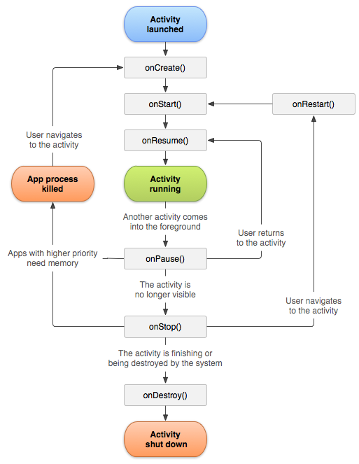

## Activity

### 4种启动模式

* standard （系统默认）

  

  在\<activity\>中添加`android:launchMode="standard"`属性 

* singleTop

  

* singleTask

  

* singleInstance

  

  


### 生命周期



### 启动方式

* 显示启动

  ```java
  Intent it = new Intent(this, NewActivity.class);
  startActivity(it);
  ```

  

* 隐式启动

  主要用于启动系统activity

  ```java
  // action
  // uri
  Intent it = new Intent(Intent.ACTION_VIEW, Uri.parse("http://www.baidu.com"));
  startActivity(it);
  ```

  

* startActivityForResult

  ```java
  Intent it = new Intent(this, NewActivity.class);
  // requestCode 1000
  startActivityForResult(it, 1000);
  
  // 回调
  protected void onActivityResult(int requestCode, int resultCode, Intent data) {
  	switch(requestCode) {
  		case 1000: {
  			// handle
  		}
  	}
  }
  ```

  