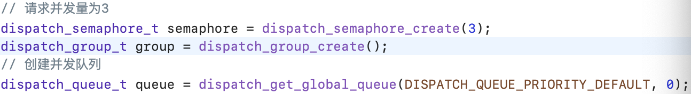
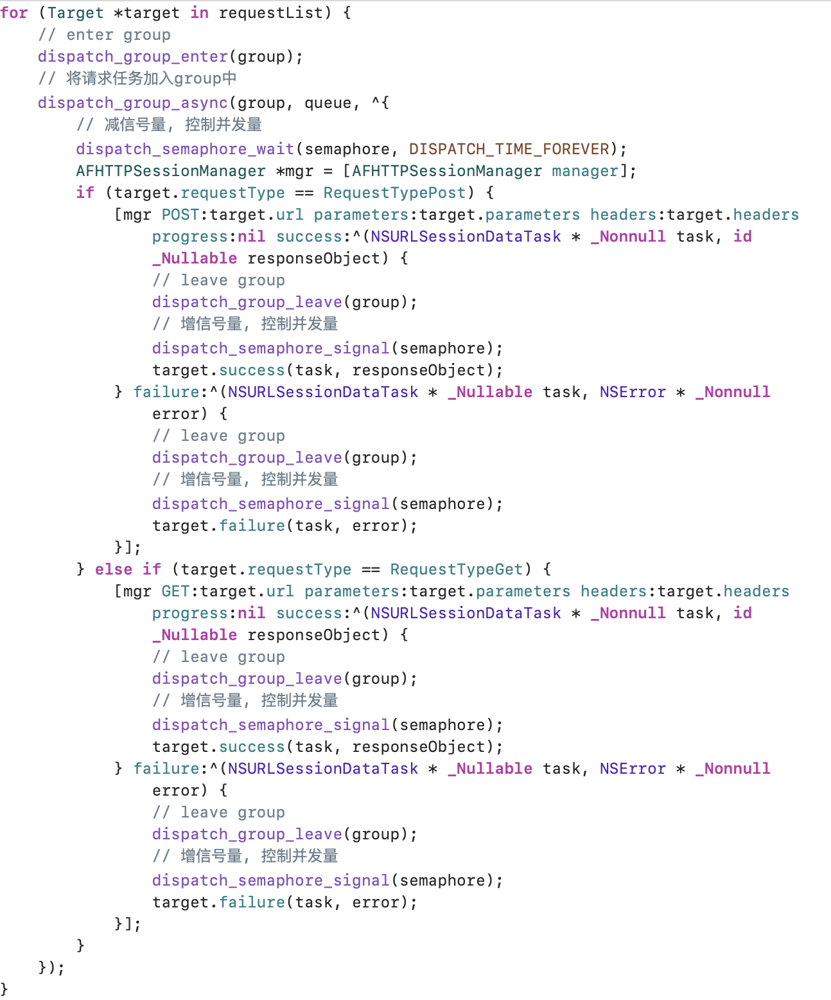
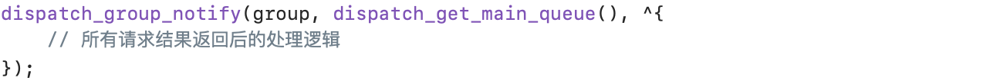

# Implementation details

## 接口访问的并发量控制及统一回调

* 请求对象

```objective-c
@interface Target: NSObject

/// 请求类型
@property (nonatomic, assign) RequestType requestType;

/// 认证value
@property (nonatomic, copy) NSString *authorization;

/// 请求的url
@property (nonatomic, copy) NSString *url;

/// 可接受的类型集合
@property (nonatomic, strong) NSSet *acceptableContentTypes;

/// 请求参数
@property (nonatomic, strong) NSDictionary *parameters;

/// 成功回调
@property (nonatomic, copy) void (^success)(id _Nullable task, id _Nullable responseObject);

/// 失败回调
@property (nonatomic, copy) void (^failure)(id _Nullable task, NSError * _Nullable error);

@end
```

* 处理请求

  

  

  

## NSTimer强引用问题的解决方案

* 用dispatch_source_t封装一个Timer

  ```objective-c
  dispatch_source_t timer = dispatch_source_create(DISPATCH_SOURCE_TYPE_TIMER,
                                              0,
                                              0,
                                              self.privateSerialQueue);
  - (void)schedule {
      [self resetTimerProperties];
  
      __weak MSWeakTimer *weakSelf = self;
  
      dispatch_source_set_event_handler(self.timer, ^{
          [weakSelf timerFired];
      });
  
      dispatch_resume(self.timer);
  }
  
  - (void)invalidate {
      // We check with an atomic operation if it has already been invalidated. Ideally we would synchronize this on the private queue,
      // but since we can't know the context from which this method will be called, dispatch_sync might cause a deadlock.
      if (!OSAtomicTestAndSetBarrier(7, &_timerFlags.timerIsInvalidated))
      {
          dispatch_source_t timer = self.timer;
          dispatch_async(self.privateSerialQueue, ^{
              dispatch_source_cancel(timer);
              ms_release_gcd_object(timer);
          });
      }
  }
  ```

  

* 用NSProxy代理

  ```objective-c
  @interface WeakProxy: NSProxy
  @property (nonatomic, weak)id target;
  + (instancetype)proxyWithTarget:(id)target;
  @end
    
  @implementation WeakProxy
  + (instancetype)proxyWithTarget:(id)target {
      WeakProxy *proxy = [[self class] alloc];
      proxy.target = target;
      return proxy;
  }
  
  //获取target类中的sel方法的方法签名
  - (NSMethodSignature *)methodSignatureForSelector:(SEL)sel {
      return [self.target methodSignatureForSelector:sel];
  }
  
  - (void)forwardInvocation:(NSInvocation *)invocation {
      //判断target是否实现了该方法
      if ([self.target respondsToSelector:invocation.selector]) {
          //让target调用该方法
          [invocation invokeWithTarget:self.target];
      }else {
          //找不到该方法
          [invocation doesNotRecognizeSelector:invocation.selector];
      }
  }
  
  @end
    
  _timer = [NSTimer scheduledTimerWithTimeInterval:1 target:[TargetProxy proxyWithTarget:self] selector:@selector(yourMethod) userInfo:nil repeats:YES];
  ```

  

## 高清大图的解码及异步渲染过程

[iOS图片加载过程以及优化](https://www.dazhuanlan.com/2019/11/07/5dc3d3911f8f8/)

[iOS 保持界面流畅的技巧](https://blog.ibireme.com/2015/11/12/smooth_user_interfaces_for_ios/)

[SDWebImage 源码](https://github.com/SDWebImage/SDWebImage)

[YYImage 源码](https://github.com/ibireme/YYImage)

[渐进式 YYWebImage 源码](https://github.com/ibireme/YYWebImage)

[mmap内存映射 字节对齐 FastImageCache 源码](https://github.com/path/FastImageCache)


## 高清大图的压缩过程


## 高清视频的压缩过程


## 富文本的布局计算及渲染过程


## 崩溃问题监控


## 卡顿问题监控


## OOM监控


## 电量消耗监控


## Cocoapods如何在组件的开发期间控制组件版本

