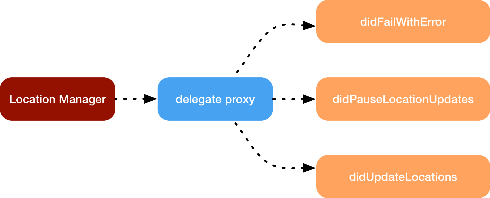
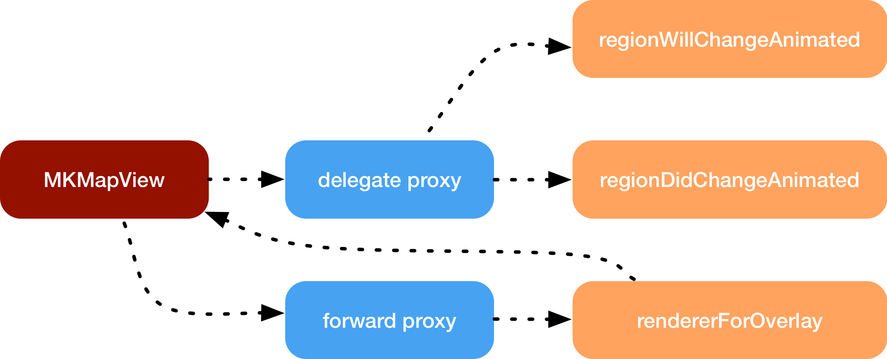

## RxCocoa

### Extension CLLocationManager

```
Question:
1. 怎样为CLLocationManager的实例添加rx名称空间？
2. 为CLLocationManager的实例的rx名称空间里定义可观察存储属性
3. 这个可观察存储属性如何获取CLLocationManager的delegate接收到的数据并发起事件给订阅者？
4. DelegateProxy的作用是什么？
5. DelegateProxy如何代理CLLocationManager的delegate接收到的数据？
```


#### 1.怎样为CLLocationManager添加rx名称空间

```swift
// 定义在RxSwift中的Reactive.swift文件中
public struct Reactive<Base> {
    /// Base object to extend.
    public let base: Base

    /// Creates extensions with base object.
    ///
    /// - parameter base: Base object.
    public init(_ base: Base) {
        self.base = base
    }
}

public protocol ReactiveCompatible {
    /// Extended type
    associatedtype ReactiveBase

    @available(*, deprecated, renamed: "ReactiveBase")
    typealias CompatibleType = ReactiveBase

    /// Reactive extensions.
    static var rx: Reactive<ReactiveBase>.Type { get set }

    /// Reactive extensions.
    var rx: Reactive<ReactiveBase> { get set }
}

extension ReactiveCompatible {
    /// Reactive extensions.
    public static var rx: Reactive<Self>.Type {
        get {
            return Reactive<Self>.self
        }
        // swiftlint:disable:next unused_setter_value
        set {
            // this enables using Reactive to "mutate" base type
        }
    }

    /// Reactive extensions.
    public var rx: Reactive<Self> {
        get {
            return Reactive(self)
        }
        // swiftlint:disable:next unused_setter_value
        set {
            // this enables using Reactive to "mutate" base object
        }
    }
}

extension NSObject: ReactiveCompatible { }

// 扩展Reactive, 为CLLocationManager添加rx名称空间
public extension Reactive where Base: CLLocationManager {}
```


#### 2. 为rx添加可观察的存储属性

```swift
public extension Reactive where Base: CLLocationManager {
  var didUpdateLocations: Observable<[CLLocation]> {
    
  }
}
```


#### 3. 当CLLocationManager的代理接收到数据时，可观察对象发起事件给订阅者

```swift
public extension Reactive where Base: CLLocationManager {
  var delegate: DelegateProxy<CLLocationManager, CLLocationManagerDelegate> {
        RxCLLocationManagerDelegateProxy.proxy(for: base)
    }
  
  var didUpdateLocations: Observable<[CLLocation]> {
    delegate
    .methodInvoked(
      #selector(CLLocationManagerDelegate.locationManager(_:didUpdateLocations:))
    )
    .map { parameters in
      parameters[1] as! [CLLocation]
    }
  }
}
```


#### 4. DelegateProxy是什么




*The DelegateProxy object creates a fake delegate object, which will proxy all the data received into dedicated observables*

##### 定义委托代理RxCLLocationManagerDelegateProxy, 代理接收到的数据给可观察序列

**RxCLLocationManagerDelegateProxy**

```swift
class RxCLLocationManagerDelegateProxy: DelegateProxy<CLLocationManager, CLLocationManagerDelegate>, DelegateProxyType, CLLocationManagerDelegate {

    weak public private(set) var locationManager: CLLocationManager?

    public init(locationManager: ParentObject) {
        self.locationManager = locationManager
        super.init(parentObject: locationManager, delegateProxy: RxCLLocationManagerDelegateProxy.self)
    }

    static func registerKnownImplementations() {
        register {
            RxCLLocationManagerDelegateProxy(locationManager: $0)
        }
    }
}
```


#### 5. DelegateProxy如何代理CLLocationManager的delegate接收到的数据

1. RxCLLocationManagerDelegateProxy实例的创建过程

   ```swift
   let locationManager = CLLocationManager.init()
   locationManager.rx.delegate即为RxCLLocationManagerDelegateProxy的实例
   // DelegateProxyType.swift
   // 通过存储属性delegate的get方法, 该委托代理的实例化是通过RxCLLocationManagerDelegateProxy.proxy(for: base)实现的
   // 1. RxCLLocationManagerDelegateProxy的实例是作为CLLocationManager实例的关联属性保存的
   // 2. ParentObject为CLLocationManager的实例对象
   public static func proxy(for object: ParentObject) -> Self {
     // 1. 获取CLLocationManager实例对象标识为self.identifier的关联属性
     let maybeProxy = self.assignedProxy(for: object)
     let proxy: AnyObject
     if let existingProxy = maybeProxy {
       // 2. 如果该关联属性存在, 则返回该关联属性
       proxy = existingProxy
     } else {
       // 3. 如果该关联属性不存在, 则创建该实例
       proxy = castOrFatalError(self.createProxy(for: object))
       // 4. 保存为CLLocationManager实例的关联属性
       self.assignProxy(proxy, toObject: object)
     }
     let currentDelegate = self._currentDelegate(for: object)
     let delegateProxy: Self = castOrFatalError(proxy)
     return delegateProxy
   }
   ```

   * 创建RxCLLocationManagerDelegateProxy的实例

     ```swift
     // DelegateProxyType.swift
     // object为CLLocationManager的实例对象
     public static func createProxy(for object: AnyObject) -> Self {
       return castOrFatalError(factory.createProxy(for: object))
     }
     ```

   * factory是什么

     ```swift
     // DelegateProxyType.swift
     extension DelegateProxyType {
       // 1. factory是DelegateProxyType扩展的静态存储属性
         private static var factory: DelegateProxyFactory {
           // self为RxCLLocationManagerDelegateProxy类对象, 它遵守DelegateProxyType协议
             return DelegateProxyFactory.sharedFactory(for: self)
         }
     }
     
     // 这里使用了工厂模式, _sharedFactories里保存了各DelegateProxyType类所对应的工厂实例DelegateProxyType
     private class DelegateProxyFactory {
       private static var _sharedFactories: [UnsafeRawPointer: DelegateProxyFactory] = [:]
       // proxyType为RxCLLocationManagerDelegateProxy类对象
       fileprivate static func sharedFactory<DelegateProxy: DelegateProxyType>(for proxyType: DelegateProxy.Type) -> DelegateProxyFactory {
         // 泛型DelegateProxy即为RxCLLocationManagerDelegateProxy
         let identifier = DelegateProxy.identifier
         if let factory = _sharedFactories[identifier] {
           return factory
         }
         let factory = DelegateProxyFactory(for: proxyType)
         _sharedFactories[identifier] = factory
         // 保存DelegateProxy的子类到factory
         DelegateProxy.registerKnownImplementations()
         return factory
       }
     }
     ```

     * registerKnownImplementations

       * 作用

         注册子类RxCLLocationManagerDelegateProxy的实例化闭包

       * 调用链路

         1. 

         ```swift
         private class DelegateProxyFactory {
           fileprivate static func sharedFactory<DelegateProxy: DelegateProxyType>(for proxyType: DelegateProxy.Type) -> DelegateProxyFactory {
             ...
             DelegateProxy.registerKnownImplementations()
             ...
           }
         }
         ```

         2. 

         ```swift
         class RxCLLocationManagerDelegateProxy: DelegateProxy<CLLocationManager, CLLocationManagerDelegate>, DelegateProxyType, CLLocationManagerDelegate {
           static func registerKnownImplementations() {
                 register {
                     RxCLLocationManagerDelegateProxy(locationManager: $0)
                 }
             }
         }
         ```

         3. 

         ```swift
         extension DelegateProxyType {
           // Parent的类型是CLLocationManager
           public static func register<Parent>(make: @escaping (Parent) -> Self) {
             self.factory.extend(make: make)
           }
         }
         ```

         4. 

         ```swift
         // ParentObject的类型是CLLocationManager, 闭包的返回类型是DelegateProxy的子类RxCLLocationManagerDelegateProxy
         func extend<DelegateProxy: DelegateProxyType, ParentObject>(make: @escaping (ParentObject) -> DelegateProxy) {
           ...
           // 这里factory的key是类对象CLLocationManager的identifier
           self._factories[ObjectIdentifier(ParentObject.self)] 
           = {make(castOrFatalError($0)) }
           ...
         }
         ```

     *通过以上调用，DelegateProxyFactory的实例在调用createProxy方法时，就能获取到相应的闭包，返回闭包所创建的实例对象RxCLLocationManagerDelegateProxy*

   * 工厂DelegateProxyFactory如何创建RxCLLocationManagerDelegateProxy实例

     ```swift
     private class DelegateProxyFactory {
       // object为CLLocationManager的实例对象
       fileprivate func createProxy(for object: AnyObject) -> AnyObject {
         var maybeMirror: Mirror? = Mirror(reflecting: object)
         while let mirror = maybeMirror {
           // 获取注册过的闭包
           if let factory = self._factories[ObjectIdentifier(mirror.subjectType)] {
             // 调用该闭包返回RxCLLocationManagerDelegateProxy的实例化对象
             return factory(object)
           }
           maybeMirror = mirror.superclassMirror
         }
       }
     }
     ```

     

2. RxCLLocationManagerDelegateProxy实例成为CLLocationManager对象的代理

   ```swift
   public static func proxy(for object: ParentObject) -> Self {
     ...
     self._setCurrentDelegate(proxy, to: object)
     ...
   }
   
   extension DelegateProxyType where ParentObject: HasDelegate, Self.Delegate == ParentObject.Delegate {
     public static func setCurrentDelegate(_ delegate: Delegate?, to object: ParentObject) {
       object.delegate = delegate
     }
   }
   ```

3. 生成可观察序列

   ```swift
   open class DelegateProxy<P: AnyObject, D>: _RXDelegateProxy {
     open func methodInvoked(_ selector: Selector) -> Observable<[Any]> {
       // 每个selector对应一个MessageDispatcher实例
     	let subject = self._methodInvokedForSelector[selector]
     	if let subject = subject {
         // _methodInvokedForSelector中存在
       	return subject.asObservable()
     	} else {
         // 不存在, 则实例化对应的MessageDispatcher实例并保存
       	let subject = MessageDispatcher(selector: selector, delegateProxy: self)
       	self._methodInvokedForSelector[selector] = subject
       	return subject.asObservable()
     	}
   	}
   }
   ```

4. 通过消息转发机制，转发对应的代理方法所获取到的数据

   *由于在实例化RxCLLocationManagerDelegateProxy的过程中，已经将RxCLLocationManagerDelegateProxy的实例作为CLLocationManager对象的delegate，但是并没有提供对应代理方法的实现，所有底层在通过代理调用相应的代理方法时，会因为找不到对应的方法实现而进行消息转发*

   * 委托代理的继承体系

   ```swift
   RxCLLocationManagerDelegateProxy:DelegateProxy:_RXDelegateProxy
   open class DelegateProxy<P: AnyObject, D>: _RXDelegateProxy {}
   ```

   ```objective-c
   @interface _RXDelegateProxy : NSObject
   @end
     
   @implementation _RXDelegateProxy
   @end
   ```

   * 生成事件转发给订阅者

   ```objective-c
   @implementation _RXDelegateProxy
   -(void)forwardInvocation:(NSInvocation *)anInvocation {
       BOOL isVoid = RX_is_method_signature_void(anInvocation.methodSignature);
       NSArray *arguments = nil;
       if (isVoid) {
           arguments = RX_extract_arguments(anInvocation);
           [self _sentMessage:anInvocation.selector withArguments:arguments];
       }
       
       if (self._forwardToDelegate && [self._forwardToDelegate respondsToSelector:anInvocation.selector]) {
           [anInvocation invokeWithTarget:self._forwardToDelegate];
       }
   
       if (isVoid) {
           [self _methodInvoked:anInvocation.selector withArguments:arguments];
       }
   }
   @end
   ```

   ```swift
   open class DelegateProxy<P: AnyObject, D>: _RXDelegateProxy {
     open override func _sentMessage(_ selector: Selector, withArguments arguments: [Any]) {
       // 获取可观察序列, 发送事件给订阅者
       self._sentMessageForSelector[selector]?.on(.next(arguments))
     }
   
     open override func _methodInvoked(_ selector: Selector, withArguments arguments: [Any])     {
       // 获取可观察序列, 发送事件给订阅者
       self._methodInvokedForSelector[selector]?.on(.next(arguments))
      }
   }
   ```


### Extension a UIKit view

*MKMapView, for example*

```
Question:
1. 为什么在Rx中包装一个具有返回类型的委托是一件困难的事情？
2. 怎样处理带有返回值的代理方法？
```

#### 1. 为什么在Rx中包装一个具有返回类型的委托是一件困难的事情？

* 带有返回类型的委托方法并不用于观察，而是用于自定义行为
* 定义一个在任何情况下都可以工作的自动默认值不是一项简单的任务


#### 2. 怎样处理带有返回值的代理方法？

*转发带有返回值的委托方法调用*



 

```swift
public extension Reactive where Base: MKMapView {
    var delegate: DelegateProxy<MKMapView, MKMapViewDelegate> {
      RxMKMapViewDelegateProxy.proxy(for: base)
    }

  // 转发带有返回值的委托方法调用给MKMapView
    func setDelegate(_ delegate: MKMapViewDelegate) -> Disposable {
        RxMKMapViewDelegateProxy.installForwardDelegate(delegate, retainDelegate: false, onProxyForObject: self.base)
    }

    var overlay:Binder<MKOverlay> {
        Binder(base) { mapView, overlay in
            mapView.removeOverlays(mapView.overlays)
            mapView.addOverlay(overlay)
        }
    }
}

// 上层以传统方式遵守MKMapViewDelegate协议并实现其带有返回值的委托方法
extension ViewController: MKMapViewDelegate {
  func mapView(_ mapView: MKMapView,
               rendererFor overlay: MKOverlay) -> MKOverlayRenderer {
    guard let overlay = overlay as? ApiController.Weather.Overlay else {
      return MKOverlayRenderer()
    }

    return ApiController.Weather.OverlayView(overlay: overlay,
                                             overlayIcon: overlay.icon)
  }
}
```


**转发过程的底层实现**

*调用链路*

1. 

```swift
public extension Reactive where Base: MKMapView {
  func setDelegate(_ delegate: MKMapViewDelegate) -> Disposable {
        RxMKMapViewDelegateProxy.installForwardDelegate(delegate, retainDelegate: false, onProxyForObject: self.base)
    }
}
```

2. 

```swift
extension DelegateProxyType {
  // forwardDelegate为遵守MKMapViewDelegate协议并提供相应委托方法实现的对象，即上层的ViewController实例对象
  // ParentObject为MKMapView的实例
  public static func installForwardDelegate(_ forwardDelegate: Delegate, retainDelegate: Bool, onProxyForObject object: ParentObject) -> Disposable {
    weak var weakForwardDelegate: AnyObject? = forwardDelegate as AnyObject
    // proxy为委托代理对象，即RxMKMapViewDelegateProxy的实例
    let proxy = self.proxy(for: object)
    proxy.setForwardToDelegate(forwardDelegate, retainDelegate: retainDelegate)
    ...
  }
}
```

3. 

```swift
open func setForwardToDelegate(_ delegate: Delegate?, retainDelegate: Bool) {
  self._setForwardToDelegate(delegate, retainDelegate: retainDelegate)
}
```

4. 

```swift
@interface _RXDelegateProxy () {}
@implementation _RXDelegateProxy {
  // forwardToDelegate为遵守MKMapViewDelegate协议并提供相应委托方法实现的对象，即上层的ViewController实例对象
  -(void)_setForwardToDelegate:(id __nullable)forwardToDelegate retainDelegate:(BOOL)retainDelegate {
    __forwardToDelegate = forwardToDelegate;
    if (retainDelegate) {
        self.strongForwardDelegate = forwardToDelegate;
    } else {
        self.strongForwardDelegate = nil;
    }
	}
}
```

5. 生成事件转发给订阅者

```objective-c
@implementation _RXDelegateProxy
-(void)forwardInvocation:(NSInvocation *)anInvocation {
   ... 
    if (self._forwardToDelegate && [self._forwardToDelegate respondsToSelector:anInvocation.selector]) {
        [anInvocation invokeWithTarget:self._forwardToDelegate];
    }
  ...
}
@end
```

