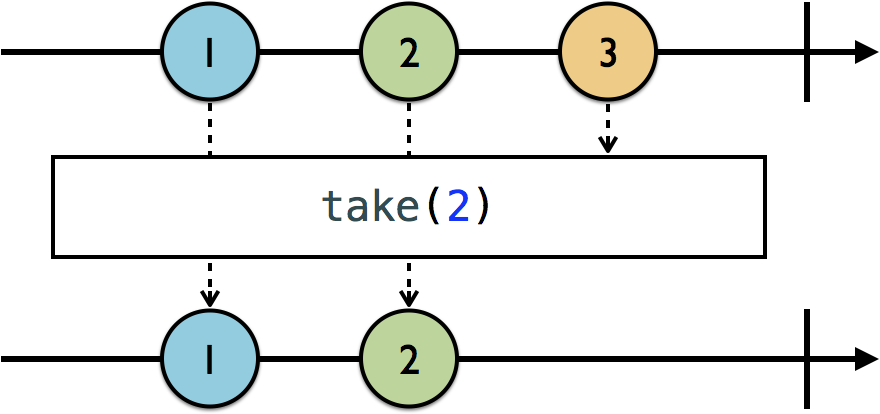
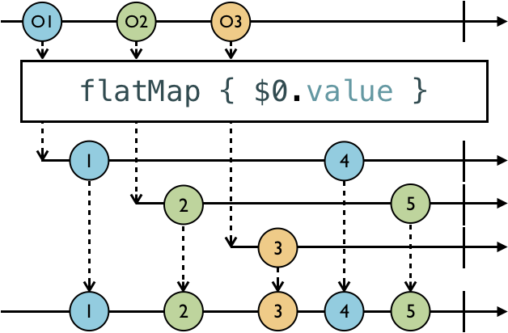
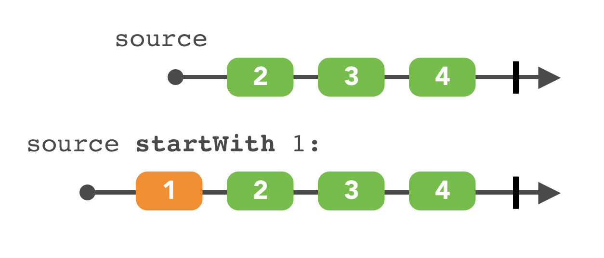
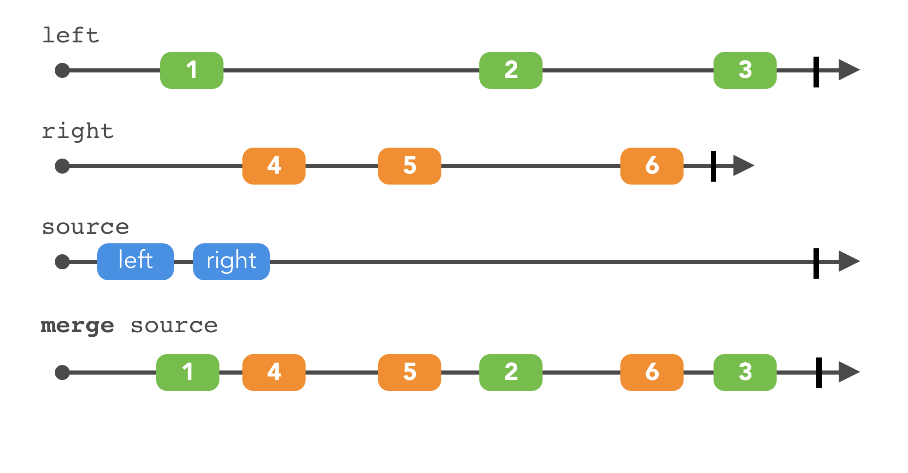
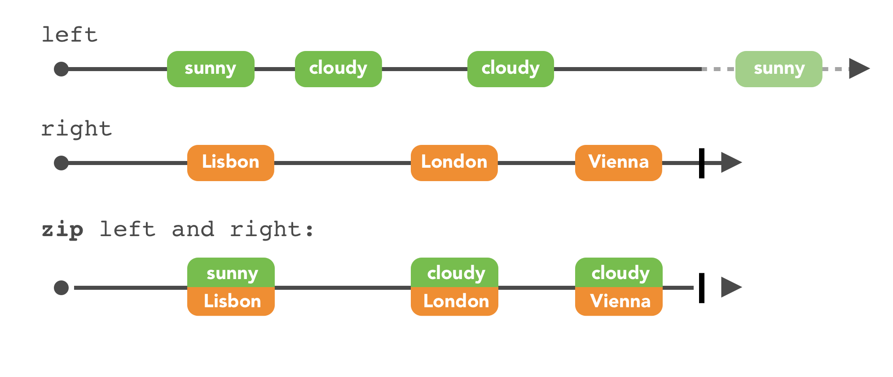
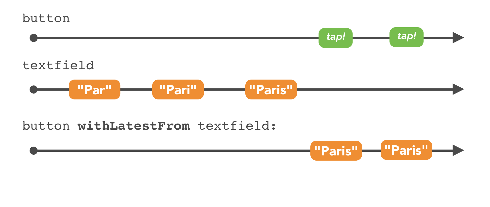

## Observable

### What is an observable?

An `Observable` is just a sequence, with some special powers. One of these powers — in fact the most important one — is that it is **asynchronous**. Observables produce events over a period of time, which is referred to as **emitting**.

* An observable emits **next** events that contain elements.
* It can continue to do this until a **terminating event** is emitted, i.e., an **error** or **completed** event.
* Once an observable is terminated, it can no longer emit events.

### Creating observables

* just

  ```swift
  public static func just(_ element: Self.Element) -> RxSwift.Observable<Self.Element>
  Observable<Int>.just(1)
  ```

  

* of

  ```swift
  public static func of(_ elements: Element ..., scheduler: ImmediateSchedulerType = CurrentThreadScheduler.instance) -> Observable<Element>
  Observable.of(1, 2, 3)
  ```

  

* from

  ```swift
  public static func from(_ array: [Self.Element], scheduler: RxSwift.ImmediateSchedulerType = CurrentThreadScheduler.instance) -> RxSwift.Observable<Self.Element>
  Observable.from([1, 2, 3])
  ```

### Subscribing to observables

```swift
public func subscribe(_ on: @escaping (RxSwift.Event<Self.Element>) -> Void) -> RxSwift.Disposable

// event为observable发出的事件，event.element为事件中携带的value
observable.subscribe { event in
   print(event)
   if let element = event.element {
      print(element)
   }
}
```

```swift
public func subscribe(onNext: ((Self.Element) -> Void)? = nil, onError: ((Error) -> Void)? = nil, onCompleted: (() -> Void)? = nil, onDisposed: (() -> Void)? = nil) -> RxSwift.Disposable

// element为事件中携带的value
observable.subscribe(onNext: { element in
  print(element)
})
```

### Disposing and terminating

*An observable doesn’t do anything until it receives a subscription. It’s the subscription that triggers an observable’s work, causing it to emit new events until an `error` or `completed` event terminates the observable. However, you can also manually cause an observable to terminate by canceling a subscription to it.*

*If you forget to add a subscription to a dispose bag, or manually call `dispose` on it when you’re done with the subscription, or in some other way cause the observable to terminate at some point, you will probably leak memory.*

* dispose()

  ```swift
  let subscription = observable.subscribe { event in }
  subscription.dispose()
  ```

* disposeBag

  *Managing each subscription individually would be tedious, so RxSwift includes a `DisposeBag` type. A dispose bag holds disposables — typically added using the `disposed(by:)` method — and will call `dispose()` on each one when the dispose bag is about to be deallocated.*

  ```swift
  let disposeBag = DisposeBag()
  Observable.of("A", "B", "C")
    .subscribe {}
    .disposed(by: disposeBag)
  ```

### Traits

* Single

  *`Single`s will emit either a `success(value)` or `error(error)` event. `success(value)` is actually a combination of the `next` and `completed` events*

* Completable

  *A `Completable` will only emit a `completed` or `error(error)` event. It will not emit any values*

* Maybe

  *Maybe is a mashup of a Single and Completable. It can either emit a success(value), completed or error(error)*


## Subject

*Subject can act as both an observable and as an observer*

### PublishSubject

*Starts empty and only emits new elements to subscribers.*

*Publish subjects come in handy when you simply want subscribers to be notified of new events from the point at which they subscribed, until either they unsubscribe, or the subject has terminated with a `completed` or `error` event.*


```swift
let subject = PublishSubject<String>()
let subscriptionOne = subject
  .subscribe(onNext: { string in
    print(string)
  })
subject.on(.next("1"))
```


**subjects, once terminated, will re-emit their stop event to future subscribers**

### BehaviorSubject

*Starts with an initial value and replays it or the latest element to new subscribers.*


### ReplaySubject

*Initialized with a buffer size and will maintain a buffer of elements up to that size and replay it to new subscribers.*

```swift
let subject = ReplaySubject<String>.create(bufferSize: 2)
let disposeBag = DisposeBag()

subject.onNext("1")
subject.onNext("2")
subject.onNext("3")

// 3
subject
  .subscribe {
    print(label: "1)", event: $0)
  }
  .disposed(by: disposeBag)

subject
  .subscribe {
    print(label: "2)", event: $0)
  }
  .disposed(by: disposeBag)
}

```


## Relays

*What sets relays apart from their wrapped subjects is that they are guaranteed to never terminate.*

*you add a value onto a relay by using the `accept(_:)` method. In other words, you don’t use `onNext(_:)`. This is because relays can only `accept` values, i.e., you cannot add an `error` or `completed` event onto them.*

### PublishRelay

*A `PublishRelay` wraps a `PublishSubject`*

```swift
let relay = PublishRelay<String>()
let disposeBag = DisposeBag()
relay
  .subscribe(onNext: {
    print($0)
  })
  .disposed(by: disposeBag)

relay.accept("1")
```


### BehaviorRelay

*A `BehaviorRelay` wraps a `BehaviorSubject`*

```swift
let relay = BehaviorRelay(value: "Initial value")
let disposeBag = DisposeBag()
relay.accept("New initial value")
relay
 .subscribe {
    print(label: "1)", event: $0)
 }
 .disposed(by: disposeBag)
}

```


## Operators

### filtering

* ignoreElements

  *`ignoreElements` will ignore all `next` events. It will, however, allow stop events through, such as `completed` or `error` events.*

  

  ```swift
  let strikes = PublishSubject<String>()
  let disposeBag = DisposeBag()
  
  strikes
   .ignoreElements()
   .subscribe { _ in
     print("You're out!")
   }
   .disposed(by: disposeBag)
  
  strikes.onNext("X")
  strikes.onNext("X")
  strikes.onNext("X")
  
  strikes.onCompleted()
  
  // output:
  You're out!
  ```

* elementAt

  *takes the index of the element you want to receive, and ignores everything else.*

  

  ```swift
  let strikes = PublishSubject<String>()
  let disposeBag = DisposeBag()
  strikes
    .elementAt(2)
    .subscribe(onNext: { _ in
      print("You're out!")
    })
    .disposed(by: disposeBag)
  ```

* filter

  *takes a predicate closure and applies it to every element emitted, allowing through only those elements for which the predicate resolves to `true`*

  

  ```swift
  Observable.of(1, 2, 3, 4, 5, 6)
    .filter { $0.isMultiple(of: 2) }
    .subscribe(onNext: {
      print($0)
    })
    .disposed(by: disposeBag)
  ```

* skip

  *lets you ignore the first n elements, where n is the number you pass as its parameter*

  

  ```swift
  Observable.of("A", "B", "C", "D", "E", "F")
    .skip(3)
    .subscribe(onNext: {
      print($0)
    })
    .disposed(by: disposeBag)
  ```

* skipWhile

  *`skipWhile` only skips up until something is not skipped, and then it lets everything else through from that point on*

  

* skipUntil

  *keep skipping elements from the source observable — the one you’re subscribing to — until some other trigger observable emits.*

  

* take

  

  ```swift
  Observable.of(1, 2, 3, 4, 5, 6)
      // 2
      .take(3)
      .subscribe(onNext: {
        print($0)
      })
      .disposed(by: disposeBag)
  ```

* takeWhile

  

* takeUntil

  

* distinctUntilChanged

  *let you prevent duplicate contiguous items from getting through.*

  

  ```swift
  Observable.of("A", "A", "B", "B", "A")
      .distinctUntilChanged()
      .subscribe(onNext: {
        print($0)
      })
      .disposed(by: disposeBag)
  ```


### Transforming

* toArray

  *convert an observable sequence of elements into an array of those elements once the observable completes*

  

  ```swift
  Observable.of("A", "B", "C")
      .toArray()
      .subscribe(onSuccess: {
        print($0)
      })
      .disposed(by: disposeBag)
  ```

* map

  

* flatMap

  *projects and transforms an observable value of an observable, and then flattens it down to a target observable.*

  

  

```swift
example(of: "flatMap") {
  let disposeBag = DisposeBag()

  // 1
  let laura = Student(score: BehaviorSubject(value: 80))
  let charlotte = Student(score: BehaviorSubject(value: 90))

  // 2
  let student = PublishSubject<Student>()

  // 3
  student
    .flatMap {
      $0.score
    }
    // 4
    .subscribe(onNext: {
      print($0)
    })
    .disposed(by: disposeBag)
}

student.onNext(laura)
laura.score.onNext(85)

// output:
80
85
```


* flatMapLatest

  *flatMapLatest works just like  flatMap, What makes `flatMapLatest` different is that it will automatically switch to the latest observable and unsubscribe from the previous one*

  

  ```swift
  example(of: "flatMapLatest") {
    let disposeBag = DisposeBag()
    let laura = Student(score: BehaviorSubject(value: 80))
    let charlotte = Student(score: BehaviorSubject(value: 90))
    let student = PublishSubject<Student>()
  
    student
      .flatMapLatest {
        $0.score
      }
      .subscribe(onNext: {
        print($0)
      })
      .disposed(by: disposeBag)
  
    student.onNext(laura)
    laura.score.onNext(85)
    student.onNext(charlotte)
  
    // 1
    laura.score.onNext(95)
    charlotte.score.onNext(100)
  }
  
  // output:
  80
  85
  90
  100
  ```


### Combining

* startWith

  

  ```swift
  let numbers = Observable.of(2, 3, 4)
  let observable = numbers.startWith(1)
    _ = observable.subscribe(onNext: { value in
      print(value)
    })
  ```

* concat

  

  ```swift
  let first = Observable.of(1, 2, 3)
  let second = Observable.of(4, 5, 6)
  let observable = Observable.concat([first, second])
  
  let germanCities = Observable.of("Berlin", "Münich", "Frankfurt")
  let spanishCities = Observable.of("Madrid", "Barcelona", "Valencia")
  let observable = germanCities.concat(spanishCities)
  ```

* concatMap

  ```swift
  example(of: "concatMap") {
    // 1
    let sequences = [
      "German cities": Observable.of("Berlin", "Münich", "Frankfurt"),
      "Spanish cities": Observable.of("Madrid", "Barcelona", "Valencia")
    ]
  
    // 2
    let observable = Observable.of("German cities", "Spanish cities")
      .concatMap { country in sequences[country] ?? .empty() }
  
    // 3
    _ = observable.subscribe(onNext: { string in
        print(string)
      })
  }
  ```

* merge

  *A `merge()` observable subscribes to each of the sequences it receives and emits the elements as soon as they arrive — there’s no predefined order*

  

  ```swift
  let left = PublishSubject<String>()
  let right = PublishSubject<String>()
  
  let source = Observable.of(left.asObservable(), right.asObservable())
  let observable = source.merge()
    _ = observable.subscribe(onNext: { value in
      print(value)
    })
  
    var leftValues = ["Berlin", "Munich", "Frankfurt"]
    var rightValues = ["Madrid", "Barcelona", "Valencia"]
    repeat {
        switch Bool.random() {
        case true where !leftValues.isEmpty:
            left.onNext("Left:  " + leftValues.removeFirst())
        case false where !rightValues.isEmpty:
            right.onNext("Right: " + rightValues.removeFirst())
        default:
            break
        }
    } while !leftValues.isEmpty || !rightValues.isEmpty
  
  left.onCompleted()
  right.onCompleted()
  ```

* combineLatest

  *Every time one of the inner (combined) sequences emits a value, it calls a closure you provide. You receive the last value emitted by each of the inner sequences.*

  

  ```swift
  let left = PublishSubject<String>()
  let right = PublishSubject<String>()
  
  let observable = Observable.combineLatest(left, right) {
    lastLeft, lastRight in
    "\(lastLeft) \(lastRight)"
  }
  
  _ = observable.subscribe(onNext: { value in
    print(value)
  })
  
  print("> Sending a value to Left")
  left.onNext("Hello,")
  print("> Sending a value to Right")
  right.onNext("world")
  print("> Sending another value to Right")
  right.onNext("RxSwift")
  print("> Sending another value to Left")
  left.onNext("Have a good day,")
  
  left.onCompleted()
  right.onCompleted()
  ```

* zip

  

  ```swift
  example(of: "zip") {
    enum Weather {
      case cloudy
      case sunny
    }
    let left: Observable<Weather> = Observable.of(.sunny, .cloudy, .cloudy, .sunny)
    let right = Observable.of("Lisbon", "Copenhagen", "London", "Madrid", "Vienna")
    let observable = Observable.zip(left, right) { weather, city in
      return "It's \(weather) in \(city)"
    }
    _ = observable.subscribe(onNext: { value in
      print(value)
    })
  }
  
  ——— Example of: zip ———
  It's sunny in Lisbon
  It's cloudy in Copenhagen
  It's cloudy in London
  It's sunny in Madrid
  
  ```

* withLatestFrom

  

  ```swift
  example(of: "withLatestFrom") {
    // 1
    let button = PublishSubject<Void>()
    let textField = PublishSubject<String>()
  
    // 2
    let observable = button.withLatestFrom(textField)
    _ = observable.subscribe(onNext: { value in
      print(value)
    })
  
    // 3
    textField.onNext("Par")
    textField.onNext("Pari")
    textField.onNext("Paris")
    button.onNext(())
    button.onNext(())
  }
  ```

* switchLatest

  *only prints items from the latest sequence pushed to the `source` observable*

  

  ```swift
  example(of: "switchLatest") {
    // 1
    let one = PublishSubject<String>()
    let two = PublishSubject<String>()
    let three = PublishSubject<String>()
  
    let source = PublishSubject<Observable<String>>()
    // 2
    let observable = source.switchLatest()
    let disposable = observable.subscribe(onNext: { value in
      print(value)
    })
    // 3
    source.onNext(one)
    one.onNext("Some text from sequence one")
    two.onNext("Some text from sequence two")
  
    source.onNext(two)
    two.onNext("More text from sequence two")
    one.onNext("and also from sequence one")
  
    source.onNext(three)
    two.onNext("Why don't you see me?")
    one.onNext("I'm alone, help me")
    three.onNext("Hey it's three. I win.")
  
    source.onNext(one)
    one.onNext("Nope. It's me, one!")
    disposable.dispose()
  }
  ——— Example of: switchLatest ———
  Some text from sequence one
  More text from sequence two
  Hey it's three. I win.
  Nope. It's me, one!
  
  ```

  

## RxCocoa

### Binding observables

*bind an observable to another entity. It’s required that the consumer conforms to `ObserverType`, a write-only entity that can only accept new events but cannot be subscribed to.*


* A producer, which produces the value.
* A consumer, which processes the values from the producer.

**`bind(to:)` is an alias, or syntactic sugar, for `subscribe()`. Calling `bind(to: observer)` will internally call `subscribe(observer)`.**


### share(replay: 1)

*makes your stream reusable and transforms a single-use data source into a multi-use `Observable`.*


```swift
// share(replay: 1) 保证通过flatMapLatest生成的observable被以下四个订阅者共享；否则当有事件发出时，会为每个订阅者生成一个observable，发生四次接口调用
let search = searchCityName.rx.text.orEmpty
  .filter { !$0.isEmpty }
  .flatMapLatest { text in
    ApiController.shared
      .currentWeather(for: text)
      .catchErrorJustReturn(.empty)
  }
  .share(replay: 1)
  .observeOn(MainScheduler.instance)

search.map { "\($0.temperature)° C" }
  .bind(to: tempLabel.rx.text)
  .disposed(by: bag)

search.map(\.icon)
  .bind(to: iconLabel.rx.text)
  .disposed(by: bag)

search.map { "\($0.humidity)%" }
  .bind(to: humidityLabel.rx.text)
  .disposed(by: bag)

search.map(\.cityName)
  .bind(to: cityNameLabel.rx.text)
  .disposed(by: bag)
```


### Extension CLLocationManager

```
Question:
1. 怎样为CLLocationManager的实例添加rx名称空间？
2. 为CLLocationManager的实例的rx名称空间里定义可观察存储属性
3. 这个可观察存储属性如何获取CLLocationManager的delegate接收到的数据并发起事件给订阅者？
4. DelegateProxy的作用是什么？
5. DelegateProxy如何代理CLLocationManager的delegate接收到的数据？
```


#### 1.怎样为CLLocationManager添加rx名称空间

```swift
// 定义在RxSwift中的Reactive.swift文件中
public struct Reactive<Base> {
    /// Base object to extend.
    public let base: Base

    /// Creates extensions with base object.
    ///
    /// - parameter base: Base object.
    public init(_ base: Base) {
        self.base = base
    }
}

public protocol ReactiveCompatible {
    /// Extended type
    associatedtype ReactiveBase

    @available(*, deprecated, renamed: "ReactiveBase")
    typealias CompatibleType = ReactiveBase

    /// Reactive extensions.
    static var rx: Reactive<ReactiveBase>.Type { get set }

    /// Reactive extensions.
    var rx: Reactive<ReactiveBase> { get set }
}

extension ReactiveCompatible {
    /// Reactive extensions.
    public static var rx: Reactive<Self>.Type {
        get {
            return Reactive<Self>.self
        }
        // swiftlint:disable:next unused_setter_value
        set {
            // this enables using Reactive to "mutate" base type
        }
    }

    /// Reactive extensions.
    public var rx: Reactive<Self> {
        get {
            return Reactive(self)
        }
        // swiftlint:disable:next unused_setter_value
        set {
            // this enables using Reactive to "mutate" base object
        }
    }
}

extension NSObject: ReactiveCompatible { }

// 扩展Reactive, 为CLLocationManager添加rx名称空间
public extension Reactive where Base: CLLocationManager {}
```


#### 2. 为rx添加可观察的存储属性

```swift
public extension Reactive where Base: CLLocationManager {
  var didUpdateLocations: Observable<[CLLocation]> {
    
  }
}
```


#### 3. 当CLLocationManager的代理接收到数据时，可观察对象发起事件给订阅者

```swift
public extension Reactive where Base: CLLocationManager {
  var delegate: DelegateProxy<CLLocationManager, CLLocationManagerDelegate> {
        RxCLLocationManagerDelegateProxy.proxy(for: base)
    }
  
  var didUpdateLocations: Observable<[CLLocation]> {
    delegate
    .methodInvoked(
      #selector(CLLocationManagerDelegate.locationManager(_:didUpdateLocations:))
    )
    .map { parameters in
      parameters[1] as! [CLLocation]
    }
  }
}
```


#### 4. DelegateProxy是什么


*The DelegateProxy object creates a fake delegate object, which will proxy all the data received into dedicated observables*

##### 定义委托代理RxCLLocationManagerDelegateProxy, 代理接收到的数据给可观察序列

**RxCLLocationManagerDelegateProxy**

```swift
class RxCLLocationManagerDelegateProxy: DelegateProxy<CLLocationManager, CLLocationManagerDelegate>, DelegateProxyType, CLLocationManagerDelegate {

    weak public private(set) var locationManager: CLLocationManager?

    public init(locationManager: ParentObject) {
        self.locationManager = locationManager
        super.init(parentObject: locationManager, delegateProxy: RxCLLocationManagerDelegateProxy.self)
    }

    static func registerKnownImplementations() {
        register {
            RxCLLocationManagerDelegateProxy(locationManager: $0)
        }
    }
}
```


#### 5. DelegateProxy如何代理CLLocationManager的delegate接收到的数据

1. RxCLLocationManagerDelegateProxy实例的创建过程

   ```swift
   let locationManager = CLLocationManager.init()
   locationManager.rx.delegate即为RxCLLocationManagerDelegateProxy的实例
   // DelegateProxyType.swift
   // 通过存储属性delegate的get方法, 该委托代理的实例化是通过RxCLLocationManagerDelegateProxy.proxy(for: base)实现的
   // 1. RxCLLocationManagerDelegateProxy的实例是作为CLLocationManager实例的关联属性保存的
   // 2. ParentObject为CLLocationManager的实例对象
   public static func proxy(for object: ParentObject) -> Self {
     // 1. 获取CLLocationManager实例对象标识为self.identifier的关联属性
     let maybeProxy = self.assignedProxy(for: object)
     let proxy: AnyObject
     if let existingProxy = maybeProxy {
       // 2. 如果该关联属性存在, 则返回该关联属性
       proxy = existingProxy
     } else {
       // 3. 如果该关联属性不存在, 则创建该实例
       proxy = castOrFatalError(self.createProxy(for: object))
       // 4. 保存为CLLocationManager实例的关联属性
       self.assignProxy(proxy, toObject: object)
     }
     let currentDelegate = self._currentDelegate(for: object)
     let delegateProxy: Self = castOrFatalError(proxy)
     return delegateProxy
   }
   ```

   * 创建RxCLLocationManagerDelegateProxy的实例

     ```swift
     // DelegateProxyType.swift
     // object为CLLocationManager的实例对象
     public static func createProxy(for object: AnyObject) -> Self {
       return castOrFatalError(factory.createProxy(for: object))
     }
     ```

   * factory是什么

     ```swift
     // DelegateProxyType.swift
     extension DelegateProxyType {
       // 1. factory是DelegateProxyType扩展的静态存储属性
         private static var factory: DelegateProxyFactory {
           // self为RxCLLocationManagerDelegateProxy类对象, 它遵守DelegateProxyType协议
             return DelegateProxyFactory.sharedFactory(for: self)
         }
     }
     
     // 这里使用了工厂模式, _sharedFactories里保存了各DelegateProxyType类所对应的工厂实例DelegateProxyType
     private class DelegateProxyFactory {
       private static var _sharedFactories: [UnsafeRawPointer: DelegateProxyFactory] = [:]
       // proxyType为RxCLLocationManagerDelegateProxy类对象
       fileprivate static func sharedFactory<DelegateProxy: DelegateProxyType>(for proxyType: DelegateProxy.Type) -> DelegateProxyFactory {
         // 泛型DelegateProxy即为RxCLLocationManagerDelegateProxy
         let identifier = DelegateProxy.identifier
         if let factory = _sharedFactories[identifier] {
           return factory
         }
         let factory = DelegateProxyFactory(for: proxyType)
         _sharedFactories[identifier] = factory
         // 保存DelegateProxy的子类到factory
         DelegateProxy.registerKnownImplementations()
         return factory
       }
     }
     ```

     * registerKnownImplementations

       * 作用

         注册子类RxCLLocationManagerDelegateProxy的实例化闭包

       * 调用链路

         1. 

         ```swift
         private class DelegateProxyFactory {
           fileprivate static func sharedFactory<DelegateProxy: DelegateProxyType>(for proxyType: DelegateProxy.Type) -> DelegateProxyFactory {
             ...
             DelegateProxy.registerKnownImplementations()
             ...
           }
         }
         ```

         2. 

         ```swift
         class RxCLLocationManagerDelegateProxy: DelegateProxy<CLLocationManager, CLLocationManagerDelegate>, DelegateProxyType, CLLocationManagerDelegate {
           static func registerKnownImplementations() {
                 register {
                     RxCLLocationManagerDelegateProxy(locationManager: $0)
                 }
             }
         }
         ```

         3. 

         ```swift
         extension DelegateProxyType {
           // Parent的类型是CLLocationManager
           public static func register<Parent>(make: @escaping (Parent) -> Self) {
             self.factory.extend(make: make)
           }
         }
         ```

         4. 

         ```swift
         // ParentObject的类型是CLLocationManager, 闭包的返回类型是DelegateProxy的子类RxCLLocationManagerDelegateProxy
         func extend<DelegateProxy: DelegateProxyType, ParentObject>(make: @escaping (ParentObject) -> DelegateProxy) {
           ...
           // 这里factory的key是类对象CLLocationManager的identifier
           self._factories[ObjectIdentifier(ParentObject.self)] 
           = {make(castOrFatalError($0)) }
           ...
         }
         ```

     *通过以上调用，DelegateProxyFactory的实例在调用createProxy方法时，就能获取到相应的闭包，返回闭包所创建的实例对象RxCLLocationManagerDelegateProxy*

   * 工厂DelegateProxyFactory如何创建RxCLLocationManagerDelegateProxy实例

     ```swift
     private class DelegateProxyFactory {
       // object为CLLocationManager的实例对象
       fileprivate func createProxy(for object: AnyObject) -> AnyObject {
         var maybeMirror: Mirror? = Mirror(reflecting: object)
         while let mirror = maybeMirror {
           // 获取注册过的闭包
           if let factory = self._factories[ObjectIdentifier(mirror.subjectType)] {
             // 调用该闭包返回RxCLLocationManagerDelegateProxy的实例化对象
             return factory(object)
           }
           maybeMirror = mirror.superclassMirror
         }
       }
     }
     ```

     

2. RxCLLocationManagerDelegateProxy实例成为CLLocationManager对象的代理

   ```swift
   public static func proxy(for object: ParentObject) -> Self {
     ...
     self._setCurrentDelegate(proxy, to: object)
     ...
   }
   
   extension DelegateProxyType where ParentObject: HasDelegate, Self.Delegate == ParentObject.Delegate {
     public static func setCurrentDelegate(_ delegate: Delegate?, to object: ParentObject) {
       object.delegate = delegate
     }
   }
   ```

3. 生成可观察序列

   ```swift
   open class DelegateProxy<P: AnyObject, D>: _RXDelegateProxy {
     open func methodInvoked(_ selector: Selector) -> Observable<[Any]> {
       // 每个selector对应一个MessageDispatcher实例
     	let subject = self._methodInvokedForSelector[selector]
     	if let subject = subject {
         // _methodInvokedForSelector中存在
       	return subject.asObservable()
     	} else {
         // 不存在, 则实例化对应的MessageDispatcher实例并保存
       	let subject = MessageDispatcher(selector: selector, delegateProxy: self)
       	self._methodInvokedForSelector[selector] = subject
       	return subject.asObservable()
     	}
   	}
   }
   ```

4. 通过消息转发机制，转发对应的代理方法所获取到的数据

   *由于在实例化RxCLLocationManagerDelegateProxy的过程中，已经将RxCLLocationManagerDelegateProxy的实例作为CLLocationManager对象的delegate，但是并没有提供对应代理方法的实现，所有底层在通过代理调用相应的代理方法时，会因为找不到对应的方法实现而进行消息转发*

   * 委托代理的继承体系

   ```swift
   RxCLLocationManagerDelegateProxy:DelegateProxy:_RXDelegateProxy
   open class DelegateProxy<P: AnyObject, D>: _RXDelegateProxy {}
   ```

   ```objective-c
   @interface _RXDelegateProxy : NSObject
   @end
     
   @implementation _RXDelegateProxy
   @end
   ```

   * 生成事件转发给订阅者

   ```objective-c
   @implementation _RXDelegateProxy
   -(void)forwardInvocation:(NSInvocation *)anInvocation {
       BOOL isVoid = RX_is_method_signature_void(anInvocation.methodSignature);
       NSArray *arguments = nil;
       if (isVoid) {
           arguments = RX_extract_arguments(anInvocation);
           [self _sentMessage:anInvocation.selector withArguments:arguments];
       }
       
       if (self._forwardToDelegate && [self._forwardToDelegate respondsToSelector:anInvocation.selector]) {
           [anInvocation invokeWithTarget:self._forwardToDelegate];
       }
   
       if (isVoid) {
           [self _methodInvoked:anInvocation.selector withArguments:arguments];
       }
   }
   @end
   ```

   ```swift
   open class DelegateProxy<P: AnyObject, D>: _RXDelegateProxy {
     open override func _sentMessage(_ selector: Selector, withArguments arguments: [Any]) {
       // 获取可观察序列, 发送事件给订阅者
       self._sentMessageForSelector[selector]?.on(.next(arguments))
     }
   
     open override func _methodInvoked(_ selector: Selector, withArguments arguments: [Any])     {
       // 获取可观察序列, 发送事件给订阅者
       self._methodInvokedForSelector[selector]?.on(.next(arguments))
      }
   }
   ```


### Extension a UIKit view

*MKMapView, for example*

```
Question:
1. 为什么在Rx中包装一个具有返回类型的委托是一件困难的事情？
2. 怎样处理带有返回值的代理方法？
```

#### 1. 为什么在Rx中包装一个具有返回类型的委托是一件困难的事情？

* 带有返回类型的委托方法并不用于观察，而是用于自定义行为
* 定义一个在任何情况下都可以工作的自动默认值不是一项简单的任务


#### 2. 怎样处理带有返回值的代理方法？

*转发带有返回值的委托方法调用*


 

```swift
public extension Reactive where Base: MKMapView {
    var delegate: DelegateProxy<MKMapView, MKMapViewDelegate> {
      RxMKMapViewDelegateProxy.proxy(for: base)
    }

  // 转发带有返回值的委托方法调用给MKMapView
    func setDelegate(_ delegate: MKMapViewDelegate) -> Disposable {
        RxMKMapViewDelegateProxy.installForwardDelegate(delegate, retainDelegate: false, onProxyForObject: self.base)
    }

    var overlay:Binder<MKOverlay> {
        Binder(base) { mapView, overlay in
            mapView.removeOverlays(mapView.overlays)
            mapView.addOverlay(overlay)
        }
    }
}

// 上层以传统方式遵守MKMapViewDelegate协议并实现其带有返回值的委托方法
extension ViewController: MKMapViewDelegate {
  func mapView(_ mapView: MKMapView,
               rendererFor overlay: MKOverlay) -> MKOverlayRenderer {
    guard let overlay = overlay as? ApiController.Weather.Overlay else {
      return MKOverlayRenderer()
    }

    return ApiController.Weather.OverlayView(overlay: overlay,
                                             overlayIcon: overlay.icon)
  }
}
```


**转发过程的底层实现**

*调用链路*

1. 

```swift
public extension Reactive where Base: MKMapView {
  func setDelegate(_ delegate: MKMapViewDelegate) -> Disposable {
        RxMKMapViewDelegateProxy.installForwardDelegate(delegate, retainDelegate: false, onProxyForObject: self.base)
    }
}
```

2. 

```swift
extension DelegateProxyType {
  // forwardDelegate为遵守MKMapViewDelegate协议并提供相应委托方法实现的对象，即上层的ViewController实例对象
  // ParentObject为MKMapView的实例
  public static func installForwardDelegate(_ forwardDelegate: Delegate, retainDelegate: Bool, onProxyForObject object: ParentObject) -> Disposable {
    weak var weakForwardDelegate: AnyObject? = forwardDelegate as AnyObject
    // proxy为委托代理对象，即RxMKMapViewDelegateProxy的实例
    let proxy = self.proxy(for: object)
    proxy.setForwardToDelegate(forwardDelegate, retainDelegate: retainDelegate)
    ...
  }
}
```

3. 

```swift
open func setForwardToDelegate(_ delegate: Delegate?, retainDelegate: Bool) {
  self._setForwardToDelegate(delegate, retainDelegate: retainDelegate)
}
```

4. 

```swift
@interface _RXDelegateProxy () {}
@implementation _RXDelegateProxy {
  // forwardToDelegate为遵守MKMapViewDelegate协议并提供相应委托方法实现的对象，即上层的ViewController实例对象
  -(void)_setForwardToDelegate:(id __nullable)forwardToDelegate retainDelegate:(BOOL)retainDelegate {
    __forwardToDelegate = forwardToDelegate;
    if (retainDelegate) {
        self.strongForwardDelegate = forwardToDelegate;
    } else {
        self.strongForwardDelegate = nil;
    }
	}
}
```

5. 生成事件转发给订阅者

```objective-c
@implementation _RXDelegateProxy
-(void)forwardInvocation:(NSInvocation *)anInvocation {
   ... 
    if (self._forwardToDelegate && [self._forwardToDelegate respondsToSelector:anInvocation.selector]) {
        [anInvocation invokeWithTarget:self._forwardToDelegate];
    }
  ...
}
@end
```

