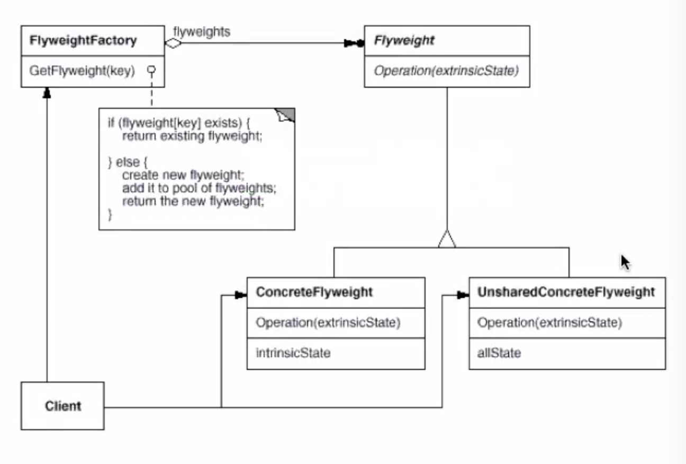

# 享元模式



```java
意图是复用对象，节省内存，前提是享元对象是不可变对象。
当一个系统中存在大量重复对象的时候，如果这些重复的对象是不可变对象，我们就可以利用享元模式将对象设计成享元，在内存中只保留一份实例，供多处代码引用
“不可变对象”指的是，一旦通过构造函数初始化完成之后，它的状态（对象的成员变量或者属性）就不会再被修改了。所以，不可变对象不能暴露任何 set() 等修改内部状态的方法
```

### 