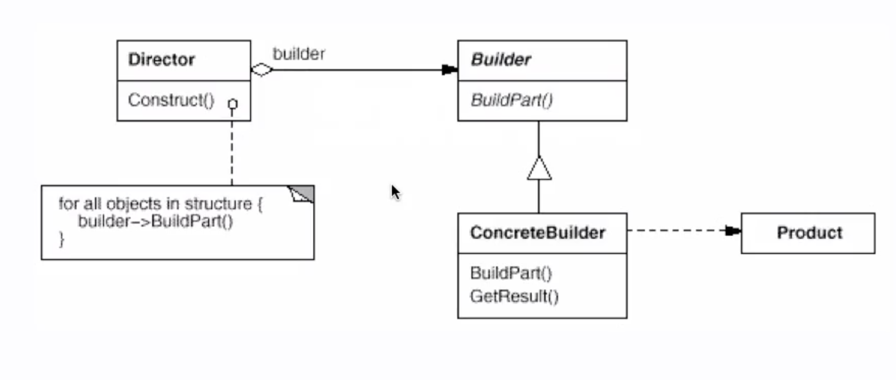

# 建造者模式



```java
对象的创建需要初始化多个成员变量，而各个成员变量的初始化对创建过程又不都是必须的，且对象创建过程中，各个成员变量的初始化间是有依赖关系的，则使用建造者模式，把成员变量的校验逻辑放到Builder 类中，先创建建造者，并且通过 set() 方法设置建造者的变量值，然后在使用 build() 方法真正创建对象之前，做集中的校验，校验通过之后才会创建对象。

public class ResourcePoolConfig {
  private String name;
  private int maxTotal;
  private int maxIdle;
  private int minIdle;

  private ResourcePoolConfig(Builder builder) {
    this.name = builder.name;
    this.maxTotal = builder.maxTotal;
    this.maxIdle = builder.maxIdle;
    this.minIdle = builder.minIdle;
  }
  //...省略getter方法...

  //我们将Builder类设计成了ResourcePoolConfig的内部类。
  //我们也可以将Builder类设计成独立的非内部类ResourcePoolConfigBuilder。
  public static class Builder {
    private static final int DEFAULT_MAX_TOTAL = 8;
    private static final int DEFAULT_MAX_IDLE = 8;
    private static final int DEFAULT_MIN_IDLE = 0;

    private String name;
    private int maxTotal = DEFAULT_MAX_TOTAL;
    private int maxIdle = DEFAULT_MAX_IDLE;
    private int minIdle = DEFAULT_MIN_IDLE;

    public ResourcePoolConfig build() {
      // 校验逻辑放到这里来做，包括必填项校验、依赖关系校验、约束条件校验等
      if (StringUtils.isBlank(name)) {
        throw new IllegalArgumentException("...");
      }
      if (maxIdle > maxTotal) {
        throw new IllegalArgumentException("...");
      }
      if (minIdle > maxTotal || minIdle > maxIdle) {
        throw new IllegalArgumentException("...");
      }

      return new ResourcePoolConfig(this);
    }

    public Builder setName(String name) {
      if (StringUtils.isBlank(name)) {
        throw new IllegalArgumentException("...");
      }
      this.name = name;
      return this;
    }

    public Builder setMaxTotal(int maxTotal) {
      if (maxTotal <= 0) {
        throw new IllegalArgumentException("...");
      }
      this.maxTotal = maxTotal;
      return this;
    }

    public Builder setMaxIdle(int maxIdle) {
      if (maxIdle < 0) {
        throw new IllegalArgumentException("...");
      }
      this.maxIdle = maxIdle;
      return this;
    }

    public Builder setMinIdle(int minIdle) {
      if (minIdle < 0) {
        throw new IllegalArgumentException("...");
      }
      this.minIdle = minIdle;
      return this;
    }
  }
}

// 这段代码会抛出IllegalArgumentException，因为minIdle>maxIdle
ResourcePoolConfig config = new ResourcePoolConfig.Builder()
        .setName("dbconnectionpool")
        .setMaxTotal(16)
        .setMaxIdle(10)
        .setMinIdle(12)
        .build();
```

