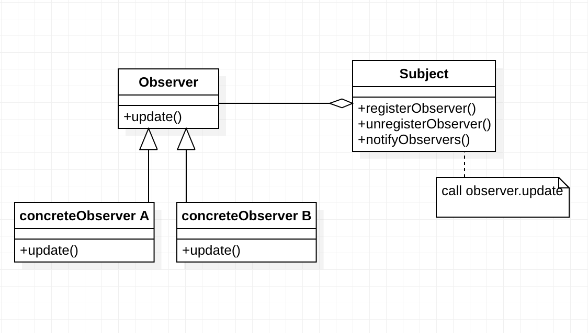

# 观察者模式



*在对象之间定义一个一对多的依赖，当一个对象状态改变的时候，所有依赖的对象都会自动收到通知。*

```java
public interface Subject {
  void registerObserver(Observer observer);
  void removeObserver(Observer observer);
  void notifyObservers(Message message);
}

public interface Observer {
  void update(Message message);
}

public class ConcreteSubject implements Subject {
  private List<Observer> observers = new ArrayList<Observer>();

  @Override
  public void registerObserver(Observer observer) {
    observers.add(observer);
  }

  @Override
  public void removeObserver(Observer observer) {
    observers.remove(observer);
  }

  @Override
  public void notifyObservers(Message message) {
    for (Observer observer : observers) {
      observer.update(message);
    }
  }

}

public class ConcreteObserverOne implements Observer {
  @Override
  public void update(Message message) {
    //TODO: 获取消息通知，执行自己的逻辑...
    System.out.println("ConcreteObserverOne is notified.");
  }
}

public class ConcreteObserverTwo implements Observer {
  @Override
  public void update(Message message) {
    //TODO: 获取消息通知，执行自己的逻辑...
    System.out.println("ConcreteObserverTwo is notified.");
  }
}

public class Demo {
  public static void main(String[] args) {
    ConcreteSubject subject = new ConcreteSubject();
    subject.registerObserver(new ConcreteObserverOne());
    subject.registerObserver(new ConcreteObserverTwo());
    subject.notifyObservers(new Message());
  }
}
```

#### 