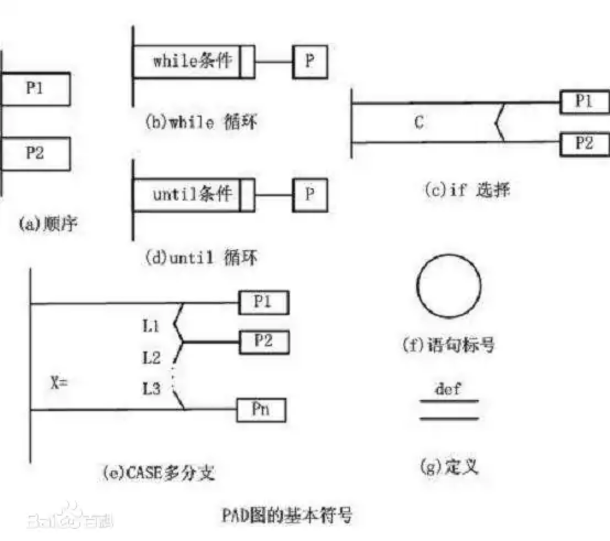

# Software Engineering

## 绪论

1. 软件

   指计算机系统中的程序及其文档

2. 软件工程

   是应用计算机科学理论和技术以及工程管理原则和方法，按预算和进度实现满足用户要求的软件产品的工程或以此为对象的学科

3. 模型

   待建模系统的任意抽象

4. 软件开发的本质

   不同抽象层术语间的“映射”，以及不同抽象层处理逻辑间的“映射”

5. 实施软件开发的基本途径

   基本途径是问题建模，建模手段有：结构化方法、面向对象方法以及面向数据结构方法等。

6. 软件工程概念提出的目的

   为了倡导以工程的原理、原则和方法进行软件开发，以期解决出现的“软件危机”
   
7. 软件系统模型

   分两类：

   1. 概念模型
   2. 软件模型
      1. 设计模型
      2. 实现模型
      3. 部署模型

## 软件需求与软件需求规约

### 需求定义及其基本特征

定义：需求是有关一个“要予构造”的陈诉，描述待开发产品功能上的能力、性能参数或其他性质。

基本特征：

1. 必要的
2. 无歧义的
3. 可测的
4. 可跟踪的
5. 可测量的

### 需求规约定义及其基本特征

定义：一个软件项所有需求陈诉的正式文档，它表达了一个软件产品的概念模型

基本特征：

1. 重要性和稳定性程度
2. 可修改的
3. 完整的
4. 一致的

### 功能需求和非功能需求，以及它们间的基本关系

功能需求规约了系统必须执行的功能；

非功能需求分为性能需求、外部接口需求、设计约束和质量属性需求

功能需求是需求的主体，非功能需求可以作用于一个或多个功能需求

外部接口需求：用户接口、硬件接口、软件接口、通信接口、内存约束、运行、地点需求

质量属性：可靠性、存活性、可维护性、用户友好性

### 需求发现技术

1. 自悟
2. 交谈
3. 观察
4. 小组会
5. 提炼

### 规约需求的三种语言

1. 非形式化的需求规约
2. 半形式化的需求规约
3. 形式化的需求规约

### 需求在软件开发中的作用

1. 需求规约是软件开发组织和用户间一份事实上的技术合同，是产品功能及其环境的体系
2. 对于项目的其余大多数工作，需求规约是一个管理控制点
3. 对于产品的设计，需求规约是一个正式的、受控的起始点
4. 需求规约是创建产品验收测试计划和用户指南的基础，它会产生两个文档：初始测试计划和用户系统操作描述

## 结构化方法

**数据流图的画法、模块结构图的画法、数据字典的定义**

### 表达问题域信息的基本术语及其表示

1. 数据流

   

2. 加工

   

3. 数据存储

   

4. 数据源和数据潭

   

### 表达功能模型的工具 -- DFD图

### 数据结构符号和判定表、判定树

1. 数据结构符号

   |  符号  |  描述  | 符号 | 描述 |
   | :----: | :----: | :--: | :--: |
   |   =    | 定义为 |  {}  | 重复 |
   |   +    |  顺序  | m..n | 子界 |
   | 【\|】 |  选择  |      |      |

   

2. 判定表

   | Ⅰ 条件类别 | Ⅱ 条件组合 |
   | :--------: | :--------: |
   |   Ⅲ 操作   | Ⅳ 操作执行 |

   

3. 判定树

### 变换型数据流图和事务型数据流图

1. 变换型数据流图

   

2. 事务型数据流图

   

* 接收输入数据
* 分析并确定对应的事务
* 选取与该事务对应的一条活动路径

### 模块以及模块内聚和耦合

模块：执行一个特殊任务的一个过程及相关数据结构，由两部分组成：接口，模块体

内聚：

耦合：

1. 内容耦合 （一个模块直接修改或操作另一模块的数据）
2. 公共耦合 （两个或以上模块共同引用一个全局数据项）
3. 控制耦合 （一个模块通过接口向另一模块发送控制信号）
4. 标记耦合 （模块A向模块B和C传递公共参数，则模块B和C存在标记耦合）
5. 数据耦合 （模块间通过参数来传递数据）

### 总体设计

目标是建立系统的模块结构，基本任务是把系统的功能需求分配到一个特定的软件体系结构中

### 详细设计

将总体设计阶段产生的系统高层结构映射为系统的最终结构

### 详细设计工具： 框图、PAD图、N-S图和伪码

* PAD

  

* N-S图

   

   

### 构建系统功能模型的步骤

1. 建立系统环境图（顶层数据流图），确定系统语境
2. 自顶向下，逐步求精，建立系统的层次数据流图
3. 定义数据字典
4. 描述加工

### 变换设计和事务设计

1. 变换设计

   在需求规约基础上，经过一系列设计步骤，将变换型数据流图转换成系统的模块结构图

2. 事务设计

   同上

### 详细设计工具的优缺点及相互转换

1. 框图

   * 优点 

     对控制流程的描述直观

   * 缺点

     1. 不是一种逐步求精的工具
     2. 控制流不受约束，影响系统结构设计
     3. 不易表示数据结构

2. N-S

   * 优点

     支持“自顶向下、逐步求精”的详细设计

   * 缺点

     修改麻烦

3. PAD

   * 优点

     1. 支持“自顶向下、逐步求精”的详细设计

     2. 易读易写
     3. 支持结构化程序设计
     4. 可自动生成代码

   * 缺点

4. PDL

   * 缺点

     不如图形工具直观

## 面向对象方法--UML

### 类、接口、用况、协作、关联、泛化、细化、依赖等概念

* 类

  一组具有相同属性、操作、关系和语义的对象的描述，主要用于抽象客观世界中的事物

* 接口

  描述类、构件或子系统的一个服务，接口就是操作的一个集合。

* 用况

  

  是对一组动作序列的描述，系统执行这些动作应产生对特定参与者有值的、可观察的结果。

* 协作

  

  是一个交互，涉及交互的三要素：交互各方、交互方式及交互内容

* 关联

  

  是对一组有相同结构、相同链的描述，是类目间的一种结构关系

* 泛化

  

  泛化的约束：完整、不完整、互斥、重叠

* 细化

  

  即接口实现，它规约了类的执行契约

* 依赖

  

  描述一个类使用另一个类的信息和服务

### 面向对象的基本思想

从现实世界中客观存在的事物出发来构造软件，并在系统构成中尽可能运用人类的思维方式，它强调以问题域中的事物为中心来思考问题，根据事物的本质特征，把它抽象表示为系统中的对象，作为系统的基本构成单位。

面向对象软件开发方法是首先获取需求，用文字、图形、表格等建立客观世界的抽象模型，识别与问题有关的类与类间的联系，逐步细化模型，完成整个系统的描述，然后对类进行编码和测试。

### UML 8大专业术语

* 类与对象

* 接口

* 协作

* 用况

* 主动类

  是至少具有一个进程或线程的类，在系统建模时，一般用于模型化系统中的并发行为

* 构件

  是系统设计中一种模块化部件，用于表达解空间中可独立标识的成分

* 制品

  是系统中包含物理信息、可替代物理部件，代表有关源代码信息或运行时信息的一个物理打包

* 节点

  是在运行时存在的物理元素，表示一种具有记忆功能和处理能力的计算机资源

### 类图创建涉及的四个方面

1. 模型化待建系统中的概念，形成类图中的基本元素
2. 模型化待建系统中的关系，形成系统的初始类图
3. 模型化系统中的协作，给出系统的最终类图
4. 模型化逻辑数据库模式

### 用况图的构成

一种表达系统功能模型的图形化工具，包含六个模型元素，即主题、用况、参与者、关联、泛化、依赖

### 顺序图的构成

由一组对象以及按时序组织的对象间的关系组成，是一种交互图，包含对象间传递的信息。

* 消息
* 对象生命线
* 聚焦控制 （表达一个对象执行一个动作的时间段）

### 状态及状态图的构成

强调从一个状态到另一个状态的控制流，是显示一个状态机的图

1. 状态图由状态、事件和状态转移构成。状态分初态、终态、通常状态
2. 事件是对确定时空内一个有意义发生的规约
3. 状态转移是两个状态间的关系，包含5个部分：源状态、转移触发器、监护条件、效应和目标状态

### 类在建模中的作用

1. 模型化问题域中的概念，使概念模型转换为系统模型中的类

2. 建立系统职责分布模型

3. 模型化建模中使用的基本类型

   

### 表达关联语义的基本手段

1. 关联名
2. 导航 （修饰关联）
3. 角色
4. 可见性
5. 多重性 （类中对象参与关联的数目）
6. 限定符
7. 聚合 （是满足一个类是另一个类的一部分性质的关联）
8. 组合 （是聚合的特殊形式）
9. 关联类 （是一种具有关联和类特性的模型元素）
10. 约束

### 对系统进行模型化时，采用以下两种方式

1. 以数据驱动

   即对所标识的每一个类，如果一个类需要导航到另一个类，那么就要在这两个类间给出一个关联

2. 以行为驱动

   如果一个类的对象需要与另一个类的对象进行交互，那么就要在这两个类间给出关联

### 系统/业务语境的模型化

1. 系统边界设定
2. 参与者与用况的交互
3. 参与者的语义表达
4. 参与者的结构化处理

## 面向对象方法 -- RUP

### RUP核心工作流

1. 列出候选需求 *产生* 特征列表
2. 理解系统语境  *产生* 领域模型或业务模型
3. 捕获系统功能需求 *产生* 用况模型
4. 捕获非功能需求 *产生* 补充需求

### RUP的突出特点

1. 以用况为驱动
2. 以体系结构的中心
3. 迭代、增量式开发

### 需求获取层、需求分析层、软件设计层上的术语

**需求获取**的目的是以UML为基础，使用UML中的用况、参与者以及依赖等术语来抽象客观实际问题，从而形成系统的需求获取模型，并产生该模型视角下的体系结构描述。

**需求分析**的目的是在系统用况模型基础上，创建系统分析模型以及在该分析模型视角下的体系结构描述。

* 分析类

  是RUP为了避免用况模型映射为设计模型时使设计工作变得复杂化引入的，以便有效的控制工作。分析类是类的一种衍型，分为边界类、实体类和控制类

  * 边界类

    它的目的在于规约系统与参与者间的交互，可以用来分离不同用户接口或不同通信接口，形成一个或多个边界类

  * 实体类

    用于规约需要长期驻留在系统中的模型化对象以及与行为相关的某些现象

  * 控制类

    封装了与特定用况有关的控制，表达复杂推导和计算，用于规约基本动作和控制流的处理与协调，涉及向其他对象委派工作

* 用况细化

  是一个协作针对一个用况，其行为可用多个分析类间的相互作用来细化，并记为用况细化

* 分析包

  分析包是一种控制信息组织复杂性的机制，提供了分析制品的一种组织手段，一个分析包中包含一些分析类，在分析阶段得到的用况细化。作用特征是体现问题分离；高内聚、低耦合；尽可能体现一个系统的完整顶层设计，尽可能成为一些子系统或成为一些子系统的组成部分

### 分析的主要活动

1. 体系结构分析

   目标是通过标识分析类和分析包，建立分析模型和体系结构骨架

   任务：

   	1. 标识分析包
    	2. 处理分析包间的共性
    	3. 标识服务包
    	4. 定义分析包依赖
    	5. 标识重要实体类
    	6. 标识分析包和重要实体类的公共需求

2. 用况分析

   目标：

   	1. 标识用况事件流执行中所需要的分析类和对象
    	2. 将用况行为，分布到参与交互的各个分析对象
    	3. 捕获用况细化上的特定需求

   任务：

   	1. 标识分析类
    	2. 描述分析对象间的交互

3. 类的分析

   目标：

   	1. 标识并维护分析类的责任
    	2. 标识并维护分析类的属性和关系
    	3. 获取分析类细化中的特殊需求

   任务：

   	1. 标识责任
    	2. 标识属性
    	3. 标识关联和聚合

4. 包的分析

   目标：

   1. 确保分析包尽可能独立
   2. 确保分析包实现了它的目标
   3. 描述依赖

### 设计

**软件设计**是定义满足需求规约所需要的软件结构。

软件结构中的基本元素是设计类、用况细化、设计子系统和接口

描述软件结构的两个角度：系统设计模型和系统部署模型

* 设计类

  是对系统实现中一个类的一个无缝抽象

* 用况细化

  是设计模型中的一个协作，描述一个特定用况是如何细化的

* 设计子系统

  可以包含设计类、用况细化、接口，以及其他子系统，通过对其操作来显示其功能

* 接口

  用于规约由设计类和设计子系统提供的操作，接口为设计类/设计子系统提供了一种分离功能的手段

### 设计的主要活动

1. 体系结构设计

   目标是创建设计模型和部署模型，以及它们视角下的体系结构描述

   任务：

   1. 标识节点和它们的网络配置
   2. 标识子系统和它们的接口
   3. 标识在体系结构方面有意义的设计类和它们的接口
   4. 标识一般性设计机制

2. 用况的设计

3. 类的设计

   目标是完成用况细化中每一类的角色设计，并完成有关每一类的非功能需求的设计

   任务：

   1. 概括描述设计类
   2. 标识操作
   3. 标识属性
   4. 标识关联和聚合
   5. 标识泛化
   6. 描述方法
   7. 描述状态

4. 子系统设计

   目标：

   1. 确保子系统尽可能独立于其他子系统或接口
   2. 确保子系统提供正确的接口
   3. 确保子系统实现了它的目标

   任务：

   1. 维护子系统依赖
   2. 维护子系统所提供的接口
   3. 维护子系统内容

   

### 用况间的基本关系

用况是对一组动作序列的描述，系统执行这些动作应产生对特定参与者有值的、可观察的结果。在系统的生命周期中，用况是基础，用来驱动系统有关人员对所要建立的系统的功能需求进行交流，驱动系统分析，设计、实现和测试等活动。用况是分析、设计、实现和测量的基本输入、分析、设计、实现和测试的结果都可以跟踪到相应的用况。通过用况可以得到体系结构描述，还可以得到相关制品。

### 系统/产品用况模型的构成

用况模型是一种概念模型，是对系统的抽象，是系统的一个模型。创建用况模型是捕获系统功能需求的目的。用况模型包含参与者、用况及它们间的关系。

给出一个系统的用况模型，主要是给出系统的用况图，给出其中每一个参与者的描述和每一个用况的描述。对每一个参与者进行描述要给出其角色和对环境的要求；对每一个用况的描述一般采用正文的事件流，给出用况的前置条件、开始动作、基本路径、每一个可选路径、参与者的交互以及结束动作和后置条件。

### 系统/产品需求分析模型构成

分析模型的目标是在一个特定的抽象层上建立系统分析模型

### 系统/产品设计模型的部署模型的构成

设计模型角度描述的制品有：

1. 子系统结构
2. 对体系结构有意义的设计类
3. 对体系结构有意义的用况细化

部署模型描述了系统的物理分布

### 创建系统/产品需求获取模型的四个步骤

1. 列出候选需求

2. 理解系统的语境

   通过创建领域模型或业务模型来理解系统语境

   领域类的三种形态：

   * 业务对象
   * 实在对象
   * 事件

3. 捕获功能需求

4. 捕获非功能需求

### 领域模型、业务模型以及在系统开发中创建它们的目的

领域模型用于捕获系统领域中的一些重要领域对象类，一般以类图表达，它以三种形态出现：

1. 业务对象
2. 实在对象
3. 概念和事件

业务模型是用于在系统开发中捕获业务处理和其中的业务对象，通过两个层次来抽象一个业务：业务用况模型和业务对象模型

### 创建系统/产品用况模型的活动和任务

活动1：发现并描述参与者

​	任务1：发现参与者

​	任务2：描述参与者

活动2：发现用况并对用况进行描述

​	任务1：发现用况

​	任务2：描述用况

活动3：确定用况的优先级

活动4：精化用况

活动5：构造用户界面原型

活动6：用况模型的结构化

### 参与者的标识与描述，以及标识中的有关准则

主要给出其角色和它对环境的要求

### 用况标识以及标识中的有关准则，用况的事件流描述技术以及描述的基本内容

一般采用正文的事件流，给出用况的前置条件、开始动作、基本路径、每一个可选路径、参与者的交互以及结束动作和后置条件。

标识用况应注意三个问题：

1. 建立用况的结构中，应尽可能反应用况的实际情况
2. 在用况的结构化中，不论是施加什么结构，新引入的用况都不应太大或太小
3. 在建立用况的结构时，应尽量避免对用况模型中的用况功能进行分解

### 创建系统/产品需求分析模型的活动和任务

活动1：体系结构分析

​			 目的：建立分析模型和体系结构骨架

​	任务1：标识分析包，该任务的基本输入是系统的用况模型

​	任务2：处理分析包间的共性

​	任务3：标识服务包

​	任务4：定义分析包的依赖，目标是发现相对独立的包，实现包的高内聚低耦合

​	任务5：标识重要的实体类，目标是标识在体系结构方面具有意义的实体类

​	任务6：标识分析包和重要实体类的公共特定需求

​				目标：依据需求获取阶段所标识的非功能需求，针对在分析期间所标识的包和分析类，标识它们的一些公共的特定需求。

活动2：用况分析

​				目标：

​						1. 标识在用况事件流执行中所需要的分析类和对象 

​						2. 将用况的行为分布到参与交互的各个分析对象 

​						3. 捕获用况细化上的特定需求

​	任务1：标识分析类，目标是标识在细化一个用况中所需要的实体类、控制类和边界类

​	任务2：描述分析类对象间的交互

活动3：类的分析

​				目标:

​						1. 标识并维护分析类的责任 

​						2. 基于它们在用况细化中的角色，标识并维护分析类的属性和关系

 					   3. 捕获分析类细化中的特殊需求

​	任务1：标识责任

​	任务2：标识属性

​	任务3：标识关联和聚合

活动4：包的分析

​				目标:

​						1. 确保分析包尽可能独立

​						2. 确保分析包实现了它的目标 

​						3. 描述依赖，益于估计未来的变化

### 创建系统/产品设计模型的活动和任务

活动1：体系结构设计，目标是创建设计模型和部署模型

​	任务1：标识节点和它们的网络配置

​	任务2：标识子系统和它们的接口

​	任务3：标识在体系结构方面有意义的设计类各它们的接口

​	任务4：标识一般性的设计机制

活动2：用况设计

​	活动1：标识参与用况细化的设计类

​	活动2：标识参与用况细化的子系统和接口

活动3：类的设计

​	任务1：概括描述设计类

​	任务2：标识操作

​	任务3：标识属性

​	任务4：标识关联和聚合

​	任务5：标识泛化

​	任务6：描述方法

​	任务7：描述状态

活动4：子系统设计

### 设计模型的四层结构

1. 设计子系统和服务子系统，以及它们的接口、依赖和内容
2. 设计类以及它们具有的操作、属性、关系及其实现的需求
3. 用况细化
4. 设计模型视角下的体系结构描述

### 针对一个小型系统，创建系统/产品用况模型、需求分析模型

#### 

### 针对一个特定类，运用状态图描述其生存周期

## 软件测试

### 软件测试

按照特定规程发现软件错误的过程

### 测试过程模型

软件测试是一个有程序的过程，包括测试设计、测试执行以及测试结果比较等

测试过程模型分三类：

环境模型：是对程序运行环境的抽象

被测对象模型：从测试的角度对程序的抽象

错误模型：对程序中的错误及其分类的抽象

### 路径测试中的被测试对象模型及其创建

* 采用控制流程图来表达被测试模型，揭示程序中的控制结构
* 通过合理xz一组穿过程序的路径，以达到某种测试度量

路径选取原则：

1. 选择最简单的、具有一定功能含义的入口/出口路径
2. 在已经选取的基础上，选择无循环的路径、短路径、简单路径
3. 选取没有明显功能含义的路径

### 测试覆盖及其它们间的基本关系

测试覆盖包括路径覆盖、语句覆盖、分支覆盖、条件覆盖于条件组合覆盖

路径覆盖：执行所有可能穿过程序控制流程的路径

语句覆盖：至少执行程序中所有语句一次

分支覆盖：至少将程序中的每一个分支执行一次

条件覆盖：指每个判定中的所有可能的条件取值，至少执行一次

条件组合覆盖：指设计足够的测试用例，使每个判定中的所有可能的条件取值组合至少执行一次

它们的基本关系是：

语句覆盖 < 分支覆盖 < 条件组合覆盖 < ... < 路径覆盖

### 事务流与控制流间的区别以及为测试带来的影响

区别：

1. 基本模型元素所表达的语义不同
2. 一个事务不等同于路径测试中的一条路径
3. 事务流程图中的分支和节点可能是一个复杂的过程

事务流程图的特点为测试带来的影响：

1. 性能增加
2. 事务流程图表达的系统模型更接近现实
3. 事务测试技术最大的问题和最大的代价是获得事务流程图以及用例设计

### 事务流测试步骤

1. 获得事务流程图
2. 浏览、复审
3. 用例设计
4. 测试执行

### 运用等价类划分技术进行测试的步骤

1. 建立等价类表
2. 为有效等价类至少设计一个测试用例
3. 为无效等价类至少设计一个测试用例

### 软件测试的基本步骤

1. 单元测试

   主要验证软件设计的最小单元--模块，该测试以详细设计文档为指导，测试模块内重要控制路径

2. 集成测试

   是软件组装的一个系统化技术，目的是发现与接口有关的错误，将经过单元测试的模块构成一个满足设计要求的软件结构。

3. 有效性测试

   目标是发现实现的功能与需求规格说明书不一致的错误

4. 系统测试

   验证将软件溶于更大系统中时整个系统的有效性

### 针对一个小型系统，创建系统的事务流测试模型

1. 获得事务流程图
2. 浏览、复审
3. 用例设计
4. 测试执行

### 针对一个特定的软件模块，运用白盒测试技术创建该模块的被测试对象模型，并给出相应的测试用例

PROCEDURE SAMPAL

​	(A,B:REAL;VAR X:REAL);

BEGIN

​	IF (A>1) AND (B=0)

​	THEN X:=X/A

IF (A=2) OR (X>1)

​	THEN X:=X+1

END;

1. 语句覆盖

   是程序中每个语句至少执行一次

   只需要设计一个测试用例：A=2，B=0, X=4

2. 分支覆盖

   使每个判定的真假分支都至少执行一次；

   可设计两组测试用例：

   * A=3，B=0, X=3，可以覆盖c,d分支
   * A=2, B=1, X=1，可以覆盖b,e分支

3. 路径覆盖

   覆盖每一个可能的路径

   | 测试用例A,B,X | 通过路径 | 覆盖分支 |
   | :-----------: | :------: | :------: |
   |    1、1、1    |   abd    |   b,d    |
   |    1、1、2    |   abe    |   b,e    |
   |    3、0、1    |   acd    |   c,d    |
   |    2、0、4    |   ace    |   c,e    |

   

4. 条件组合覆盖

   所有可能的条件取值组合至少执行一次

   A>1,B=0

   A>1,B≠0

   A≯1,B=0

   A≯1,B≠0

   A=2,X>1

   A=2,X≯1

   A≠2,X>1

   A≠2,X≯1

### 针对一个简单程序，运用等价类划分技术创建其测试模型并给出相应的测试用例

1. 建立等价类表
2. 为有效等价类设计测试用例
3. 为无效等价类至少设计一个测试用例

某报表处理系统要求用户输入处理报表的日期，日期限制在2003年1月到2008年12月，如果日期不在此范围内，则显示输入错误信息。系统日期规定有年、月组成，前4位代表年，后两位代表月。如何用等价类划分法设计测试用例，来测试程序的日期检查功能？

* 等价类划分

  |     输入条件     |    有效等价类    |                         无效等价类                          |
  | :--------------: | :--------------: | :---------------------------------------------------------: |
  | 日期的类型及长度 | 6位数字字符（1） | 非数字字符（4）\|少于6个数字字符（5）\|多余6个数字字符（6） |
  |     年份范围     | 2003~2008间（2） |                小于2003（7），大于2008（8）                 |
  |     月份范围     |   1~12间（3）    |                  小于1（9），大于12（10）                   |

* 为有效等价类设计测试用例

  | 测试数据 | 期望结果 |         覆盖范围          |
  | :------: | :------: | :-----------------------: |
  |  200306  | 输入有效 | 等价类（1）、（2）、（3） |

* 为无效等价类至少设计一个测试用例

  | 测试数据 | 期望结果 |   覆盖范围   |
  | :------: | :------: | :----------: |
  |  003MAY  | 输入无效 | 等价类（4）  |
  |  20035   | 输入无效 | 等价类（5）  |
  | 2004005  | 输入无效 | 等价类（6）  |
  |  200105  | 输入无效 | 等价类（7）  |
  |  200905  | 输入无效 | 等价类（8）  |
  |  200300  | 输入无效 | 等价类（9）  |
  |  200313  | 输入无效 | 等价类（10） |

## 软件生存周期过程与管理

### 过程分类

1. 基本过程
2. 支持过程
3. 组织过程

### 软件实现过程、活动和任务

为了生产一个已规约系统的元素，作为一个软件产品或服务

活动：软件实现策略

### 软件需求分析过程、活动和任务

建立系统软件部分的需要

活动：软件需求分析

### 软件体系结构设计过程、活动和任务

为软件的实现及其可以按需求进行验证，提供一种设计

活动：软件体系结构设计

### 软件验证过程、活动和任务

证实一个过程或项目的每一个软件工作产品/服务是否正确反映了规约的需求

活动：过程实现

### 软件实现确认、活动和任务

证实所期望使用的软件工作产品是否满足其需求

活动：过程实现和确认

### 瀑布模型

将软件生存周期各个活动规定为按固定顺序连接的若干阶段的模型。这一模型规定了各开发阶段的活动：系统需求、软件需求、需求分析、设计、编码、测试和运行，并且自上而下具有相互衔接的固定顺序；还规定每一个阶段的输入，即工作对象以及本阶段的工作成果，作为输出传送到下一阶段。

缺点：

1. 要求客户能完整、正确和清晰表达他们的需求；并要求开放人员一开始就要理解应用
2. 由于需求的不稳定，使设计、编码和测试阶段都可能发生延期
3. 在开始阶段中，很难评估真正的进度状态，且在项目结束前都不能演示系统的能力
4. 在项目早期，过分强调基线和里程碑处的文档，可能需要花费更多时间用于建立一些用处不大的文档

### 增量模型

是一种非整体开发模型，软件在该模型下是”逐渐“开发出来的，开发一部分，向客户展示一部分；该模型具有较大的灵活性，适合于软件需求不明确，设计方案有一定风险的软件项目。

优点：

1. 第一个可交付版本所需要的成本和时间是较少的
2. 减少用户需求的变更
3. 允许增量投资

缺点：

1. 如果没有对用户的变更要求进行规划，产生的初始增量可能造成后来增量的不稳定
2. 如果需求不稳定和完整，一些增量就要重新开放，发布
3. 由于进度和配置的复制性，可能会增大管理成本

### 演化模型

主要针对事先不能完整定义需求的软件开发，主要特点是显示的把需求获取扩展到需求阶段，不足之处是在演化模型的使用中，即使很好地理解了需求或设计，也很容易弱化需求分析阶段的工作。

### 螺旋模型

将瀑布模型与增量模型结合起来，加入两种模型均忽略了的风险分析，弥补了两个模型的不足。它是一种风险驱动的模型。

每个螺旋周期分4个步骤：

1. 定制计划
2. 风险分析
3. 实施工程
4. 客户评估

螺旋模型适合于大型软件的开发。

1. 螺旋模型关注解决问题的基本步骤
2. 与演化模型和增量模型相比，同样使用瀑布模型作为嵌入过程
3. 如果项目风险大，螺旋模型是一个好的生存周期模型

### 创建一个软件项目生存周期过程的步骤

1. 选择软件生存周期模型
2. 细化所选择的生存周期模型
3. 为每一个活动或认为标识合适的实例数目
4. 确定活动的时序关系，并检查信息流
5. 建立过程计划的文档

### 监控一个软件项目生存周期过程的要点

1. 软件生存周期过程的监控，在项目实施中，必须监控生存周期过程的执行情况，以确保软件开发是按规划、高效进行的
2. 生存周期过程改变所产生影响的评估，在评估过程中，要考虑以下方面的影响：
   1. 返工
   2. 资源需求
   3. 实施时间
   4. 对项目和用户的益处
   5. 员工情绪
3. 改变的实施，对项目中一个过程进行改变时，必须十分谨慎

## 集成化能力成熟度模型

### 过程改善

指人为设计的活动程序，目的是改进组织的过程性能和成熟读，并改进这一程序的结果

### 过程域、专用目标和共用目标

过程域：是一个业务域中相关实践

专用目标：描述满足过程域必须呈现的特征

共用目标：描述实现制度化的该过程必须呈现的特征

### 能力等级

指在单一过程域中已达到的过程改善，是为了管理，对过程改善程度所设定的”台阶“

### 成熟读等级

指达到预先定义的一组过程域所有目标的一种过程改善等级

### 过程制度化

指过程被渗透在执行工作的方式中，执行的工作有一定的承诺，并且在组织范围内是一致的

